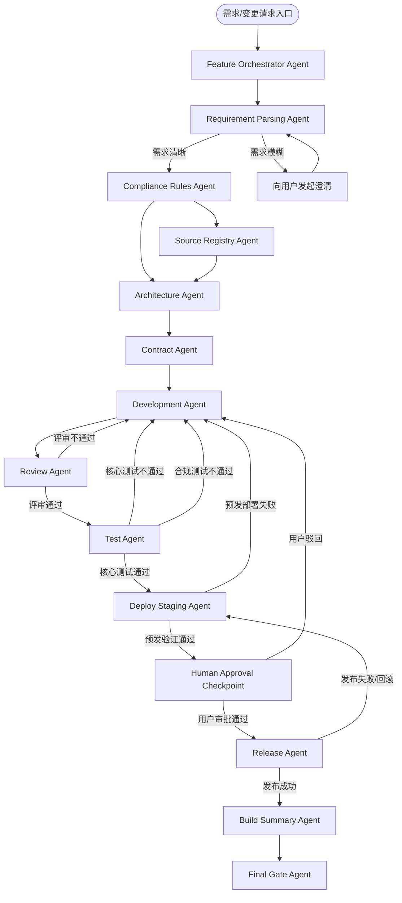
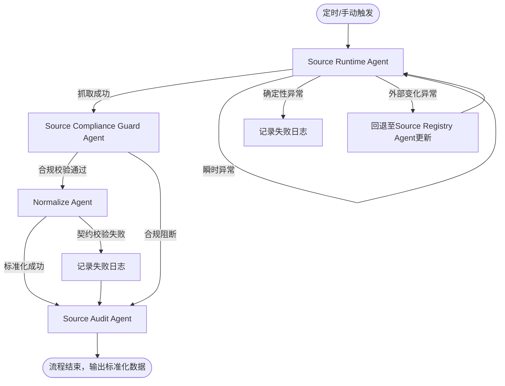
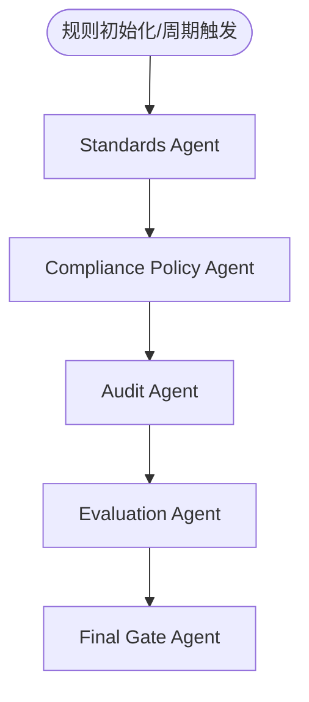

# 合规资讯源接入 Agent 体系设计文档 v1.0 正式落地版

**文档版本**：v1.0

**更新日期**：2024年XX月XX日

**适用范围**：金融合规资讯源接入全流程 Agent 原生工程系统

**核心目标**：实现「合规资讯源接入」全流程 Agent 自主执行，用户仅负责规则定义、关键节点审批、最终结果检查，其余所有环节由 Agent 闭环完成。

---

## 一、设计总纲

### 1.1 系统定位

本系统是围绕「合规资讯源接入」构建的**Agent 原生工程系统**，采用「三平面解耦架构」，实现从功能开发、日常运行到合规治理的全流程自动化、可追溯、强合规：

- **Build Plane（开发平面）**：把「合规资讯源接入」功能从0到1做出来

- **Runtime Plane（运行平面）**：让已交付的接入功能7×24小时稳定运行

- **Governance Plane（治理平面）**：让开发、运行全流程合规、可追溯、可评估

### 1.2 人类唯一职责

你不是执行者，而是系统的三类核心角色，除此之外不参与任何执行环节：

- **Rule Owner（规则所有者）**：定义系统运行的所有规则、标准、阈值

- **Approval Owner（审批所有者）**：仅在关键强制节点完成审批决策

- **Result Checker（结果检查者）**：核验最终放行结论，决定是否接受结果

**你绝对不做**：任务拆分、代码实现、测试执行、部署操作、日常排障、Agent间协调、中间结果修改。

### 1.3 核心设计原则

1. **职责单一原则**：所有 Agent 必须有明确的输入、输出、依赖、阻断条件，一个Agent只负责一件事

2. **全链路可追溯原则**：所有输出必须可追溯到规则版本、输入引用、执行日志、Agent版本

3. **异常分类处理原则**：所有失败必须按类型精准处理，禁止无意义重试、禁止盲修瞎改

4. **可中断可恢复原则**：所有关键节点必须支持 LangGraph Checkpoint 持久化，支持审批暂停、故障恢复、流程回退

5. **规则统一原则**：三平面共享统一的状态体系、规则版本、契约标准，避免规则冲突

6. **合规优先原则**：所有环节优先执行合规校验，策略类异常立即阻断，不允许降级执行

7. **工程可落地原则**：所有设计必须可直接通过 LangGraph 实现，无概念化、不可执行的内容

---

## 二、统一对象与契约规范

所有 Agent 必须严格遵循本章节的规范，确保跨Agent、跨平面交互无歧义，数据格式统一。

### 2.1 全局状态 Schema

本 Schema 为三平面三张 LangGraph 通用的状态标准，所有节点流转必须基于此结构，禁止大对象直接存入状态，仅通过引用关联。

```JSON

{
  "task_id": "string",          // 任务唯一标识，全链路唯一
  "run_id": "string",           // 单次运行实例ID，同个task_id可对应多个run_id
  "graph_type": "build|runtime|governance", // 所属图类型，区分三平面
  "stage": "string",            // 当前执行阶段，与Agent职责一一对应
  "status": "pending|running|success|fail|blocked|needs_approval", // 执行状态枚举
  "input_ref": "string",        // 输入数据引用（对象存储ID/数据库ID/文件路径，不存大对象）
  "output_ref": "string",       // 输出数据引用，规则同上
  "error": "object|null",       // 错误对象，包含：error_type、error_msg、error_source、impact_scope
  "retry_count": 0,             // 当前节点重试次数，用于控制重试策略
  "rule_version": "string",     // 执行所依据的规则版本号，全链路强制携带
  "artifact_refs": [],          // 本次执行产出物引用列表（代码包、报告、文档等）
  "approval_required": false,   // 是否触发用户审批
  "metadata": {}                // 元数据，包含执行时间、Agent版本、关联节点ID、trace_id等
}
```

### 2.2 核心业务对象定义

系统全流程围绕以下核心对象运转，所有 Agent 的输入输出必须基于这些对象的标准化结构：

|核心对象名称|定义与用途|所属平面|
|---|---|---|
|`UserRuleSet`|用户定义的所有规则集合，包含合规规则、技术规则、测试规则、部署规则、验收阈值|全平面|
|`SourceRegistry`|合规资讯源注册表，包含源分类、合法性证明、接入配置、频率限制、授权信息等|全平面|
|`RawDocument`|从资讯源抓取的原始文档对象，严格遵循Schema定义|Build/Runtime|
|`NormalizedDocument`|标准化后的合规文档对象，为下游业务提供统一数据格式|Runtime|
|`ComplianceCheckResult`|合规校验结果对象，包含校验项、是否通过、阻断原因、风险等级|全平面|
|`ContractSpec`|数据与接口契约规范，包含各类Schema、接口入参出参标准|Build/全平面|
|`BuildArtifact`|开发平面产出物，包含代码包、依赖清单、开发文档等|Build|
|`TestReport`|测试报告集合，包含功能、契约、合规、可靠性四类测试报告|Build|
|`DeployReport`|部署报告，包含预发/生产部署记录、环境验证结果、监控配置信息|Build|
|`AuditLog`|全链路审计日志，包含操作人（Agent/用户）、操作内容、时间、结果、trace_id|全平面|
|`FinalGateDecision`|最终放行决策报告，包含决策结论、规则校验矩阵、风险提示、行动建议|全平面|
|`ChangeRequest`|用户发起的变更请求对象，包含变更内容、变更原因、新规则、生效时间|全平面|
### 2.3 Agent 统一输出规范

所有 Agent 的执行输出，必须严格遵循以下结构，禁止仅输出自然语言长文，所有核心内容必须结构化：

```JSON

{
  "task_id": "string",
  "run_id": "string",
  "stage": "string",
  "agent_name": "string",
  "agent_version": "string",
  "rule_version": "string",
  "status": "success|fail|blocked|needs_approval",
  "content": "object", // 结构化核心输出，与Agent职责一一对应，禁止字符串长文
  "error": "object|null",
  "artifact_refs": [],
  "metadata": {
    "start_time": "timestamp",
    "end_time": "timestamp",
    "trace_id": "string",
    "upstream_dependency": "string"
  }
}
```

---

## 三、Agent 组织体系 v1.0

### 3.1 总体组织架构

```Plain Text

合规资讯源接入Agent系统
├── Build Plane Agents（开发建设）
├── Runtime Plane Agents（日常运行）
├── Governance Plane Agents（规则约束）
├── Final Gate Agent（最终放行决策）
└── Human Approval Checkpoint（人工审批关口）
```

### 3.2 组织原则

- Build Plane 负责**功能从0到1的建设交付**，覆盖需求解析到生产发布全流程

- Runtime Plane 负责**已交付功能的日常稳定运行**，覆盖资讯抓取、合规校验、标准化、审计全流程

- Governance Plane 负责**全流程的规则约束与治理**，覆盖标准定义、合规执行、全链路审计、效果评估

- Final Gate Agent 负责**全流程结果的最终决策**，给出明确的放行/阻断结论

- Human Approval Checkpoint 负责**用户唯一的人工决策关口**，仅在生产发布前强制触发，其余环节无人工干预

---

### 4.1 Build Plane Agent 详细规格表

Build Plane 核心目标：把「合规资讯源接入」功能从需求落地为可在生产稳定运行的交付物，全程由Agent自主执行，仅在生产发布前触发一次人工审批。

|Agent名称|类别|核心使命|核心负责内容|输入规范|输出规范|强依赖|阻断权/阻断条件|成功验收标准|
|---|---|---|---|---|---|---|---|---|
|Feature Orchestrator Agent|Build Plane/总控|全流程任务编排与进度管控，把需求从初始状态推进到可上线状态|1. 接收用户需求/变更请求，触发全流程<br>2. 子任务拆解与依赖编排<br>3. 跟踪各Agent执行状态<br>4. 异常回退流程管控<br>5. 全流程交付物汇总|1. 用户需求/变更请求<br>2. UserRuleSet<br>3. 系统上下文（现有规则、注册表、版本信息）|1. build_plan（建设计划）<br>2. subtask_list（子任务清单与依赖关系）<br>3. execution_status（全流程执行状态看板）<br>4. build_summary（建设全流程汇总）|无（流程总入口）|无阻断权，仅负责流程编排与异常转发|1. 需求完整拆解为可执行子任务，依赖关系清晰<br>2. 所有子Agent的输入输出闭环<br>3. 形成从需求到发布的完整交付链路|
|Requirement Parsing Agent|Build Plane/需求|将用户需求转化为无歧义的工程化需求规格|1. 需求语义解析与边界定义<br>2. 标记需求模糊点，必要时向用户发起澄清<br>3. 生成标准化需求规格说明书<br>4. 输出子任务拆解建议|1. user_demand（用户原始需求）<br>2. UserRuleSet|1. requirement_spec（需求规格说明书）<br>2. ambiguity_list（需求模糊点清单）<br>3. subtask_candidates（子任务建议清单）<br>4. must_not_do_list（禁止做的边界清单）|Feature Orchestrator Agent|阻断条件：<br>1. 核心需求信息不完整<br>2. 关键规则存在冲突<br>3. 需求模糊点无法通过常识补全|1. 需求边界清晰，做什么/不做什么明确<br>2. 所有输出可被下游Agent直接消费<br>3. 无歧义、无模糊表述|
|Compliance Rules Agent|Build Plane/合规|将合规要求转化为可被机器执行的规则集|1. 生成全流程合规政策与校验规则<br>2. 生成资讯源白名单准入规则<br>3. 生成字段抓取范围与限制规则<br>4. 生成敏感行为与内容的阻断条件<br>5. 规则版本管理|1. requirement_spec<br>2. UserRuleSet<br>3. 金融合规基线（内置）|1. compliance_policy（合规政策全集）<br>2. source_whitelist_policy（源准入规则）<br>3. field_capture_policy（字段抓取规则）<br>4. blocking_rules（违规阻断规则）<br>5. rule_version（规则版本号）|Requirement Parsing Agent|有阻断权：<br>一旦源类别、抓取字段、开发逻辑违反合规规则，可直接阻断后续流程|1. 所有规则可被下游Agent直接执行，无自然语言模糊表述<br>2. 覆盖开发、运行全流程的合规校验点<br>3. 规则可追溯、可审计、可版本化|
|Source Registry Agent|Build Plane/源管理|建立并维护合规资讯源的权威注册表，作为全系统的源底座|1. 维护Source Class分类体系<br>2. 收集合规源的基础信息与接入配置<br>3. 留存源合法性证明材料与授权信息<br>4. 记录源的调用频率限制、robots协议、鉴权方式<br>5. 源的生命周期管理（新增/停用/更新）|1. compliance_policy<br>2. 外部公开源的官方信息<br>3. 需求中指定的接入源范围|1. source_registry（资讯源注册表，全字段结构化）<br>2. source_legality_evidence（源合法性证明材料引用）<br>3. source_access_profile（源接入配置文件）<br>4. source_risk_level（源风险等级）|Compliance Rules Agent|阻断条件：<br>1. 无符合规则的可用合规源<br>2. 目标源的合法性无法确认<br>3. 源接入方式违反合规规则|1. 所有源分类明确，准入规则符合合规要求<br>2. 注册表信息完整，可直接用于开发与运行<br>3. 合法性证明可追溯、可审计|
|Architecture Agent|Build Plane/架构|设计合规资讯源接入功能的系统架构与技术方案|1. 功能模块划分与边界定义<br>2. 数据流转流程设计<br>3. 存储对象与结构设计<br>4. 异常处理与降级策略设计<br>5. 部署架构与资源需求草案|1. requirement_spec<br>2. compliance_policy<br>3. source_registry|1. architecture_spec（架构设计说明书）<br>2. module_boundary（模块边界与职责）<br>3. data_flow_design（数据流转流程图）<br>4. failure_strategy（异常处理与降级策略）<br>5. deploy_architecture_draft（部署架构草案）|1. Requirement Parsing Agent<br>2. Compliance Rules Agent<br>3. Source Registry Agent|无阻断权，输出方案需通过后续Review环节校验|1. 模块边界清晰，职责无重叠<br>2. 数据契约可被Contract Agent直接落地<br>3. 架构可支撑开发、运行全流程需求<br>4. 异常策略覆盖四类核心异常场景|
|Contract Agent|Build Plane/契约|定义全系统的数据对象与接口契约，统一上下游标准|1. 定义RawDocument数据Schema<br>2. 定义Connector接口契约<br>3. 定义Runtime标准化输出契约<br>4. 定义异常与错误码契约<br>5. 契约版本管理与兼容性说明|1. architecture_spec<br>2. source_registry<br>3. compliance_policy|1. raw_document_schema（原始文档Schema）<br>2. connector_contract（连接器接口契约）<br>3. runtime_output_contract（运行时输出Schema）<br>4. error_contract（异常错误码契约）<br>5. contract_version（契约版本号）|Architecture Agent|阻断条件：<br>1. Schema核心字段不完整<br>2. 契约定义与合规规则冲突<br>3. 契约无法覆盖架构设计的需求|1. 开发、运行全流程的输入输出均有对应契约<br>2. 下游开发、测试环节可直接对照契约执行<br>3. 契约有明确的版本管理与兼容性规则|
|Development Agent|Build Plane/开发|基于架构与契约，实现合规资讯源接入的全部功能代码|1. 资讯源连接器（Connector）开发<br>2. 抓取逻辑与频率控制实现<br>3. 数据标准化逻辑实现<br>4. 合规校验逻辑落地<br>5. API接口与任务执行逻辑开发<br>6. 单元测试编写|1. architecture_spec<br>2. connector_contract<br>3. source_registry<br>4. compliance_policy|1. build_artifacts（构建产物引用）<br>2. code_package（代码包仓库地址/引用）<br>3. dependency_manifest（依赖清单）<br>4. dev_notes（开发说明文档）<br>5. unit_test_report（单元测试报告）|1. Architecture Agent<br>2. Contract Agent|无阻断权，代码质量由Review Agent校验|1. 代码可直接编译运行，无语法/依赖错误<br>2. 100%符合契约规范<br>3. 实现了架构设计的全部功能<br>4. 包含基础的错误处理与日志埋点|
|Review Agent|Build Plane/评审|对开发产物进行全维度评审，阻断不符合要求的代码进入下一环节|1. 检查代码与架构设计的一致性<br>2. 检查代码与契约规范的一致性<br>3. 检查代码安全风险与合规规则落地情况<br>4. 检查代码质量与可维护性<br>5. 输出问题清单与整改建议|1. build_artifacts/code_package<br>2. architecture_spec<br>3. connector_contract<br>4. compliance_policy|1. review_report（代码评审报告）<br>2. blocking_issues（阻断性问题清单）<br>3. refactor_suggestions（重构优化建议）<br>4. review_pass（是否通过评审：true/false）|Development Agent|有阻断权：<br>核心架构、契约、合规规则不满足时，直接阻断流程，禁止进入测试环节|1. 阻断性问题清零后，才可流转至测试环节<br>2. 评审报告覆盖所有核心校验维度<br>3. 问题定位精准，可直接指导开发整改|
|Test Agent|Build Plane/测试|对开发产物进行全维度测试验证，确保功能、契约、合规、可靠性全部达标|1. 功能测试（覆盖核心场景与异常场景）<br>2. Contract测试（校验输入输出是否符合契约）<br>3. 合规测试（校验合规规则是否正确落地）<br>4. 可靠性测试（重试、降级、并发、稳定性测试）|1. code_package<br>2. connector_contract<br>3. UserRuleSet（测试阈值规则）<br>4. source_registry<br>5. compliance_policy|1. functional_test_report（功能测试报告）<br>2. contract_test_report（契约测试报告）<br>3. compliance_test_report（合规测试报告）<br>4. reliability_test_report（可靠性测试报告）<br>5. test_pass（是否通过测试：true/false）|Review Agent（评审通过后才可进入测试）|阻断条件：<br>1. 核心功能测试不通过<br>2. 合规测试存在不通过项<br>3. 可靠性指标未达用户定义阈值|1. 四类测试报告完整，覆盖所有核心场景<br>2. 核心指标全部达到用户定义的验收阈值<br>3. 测试用例可追溯、可复现|
|Deploy Staging Agent|Build Plane/预发部署|将测试通过的功能部署至预发/测试环境，完成环境验证与冒烟测试|1. 预发环境部署与配置<br>2. 基础环境可用性校验<br>3. 监控指标与告警配置<br>4. 全流程冒烟测试执行|1. 全套test_reports<br>2. UserRuleSet（部署规则）<br>3. code_package|1. staging_deploy_report（预发部署报告）<br>2. smoke_test_result（冒烟测试结果）<br>3. monitor_config（监控配置信息）<br>4. deploy_pass（部署是否成功：true/false）|Test Agent（核心测试通过后才可部署）|无阻断权，部署失败触发回退与告警|1. 预发环境服务可用<br>2. 监控配置正常，指标可采集<br>3. 全流程冒烟测试100%通过|
|Release Agent|Build Plane/生产发布|经用户审批通过后，将功能灰度发布至生产环境，完成上线全流程|1. 生产环境灰度发布执行<br>2. 发布过程实时监控<br>3. 异常自动回滚控制<br>4. 生产发布报告与上线验证|1. staging_deploy_report<br>2. human_approval_result（用户审批结果）<br>3. UserRuleSet（发布规则）|1. release_report（生产发布报告）<br>2. rollout_log（灰度发布全流程日志）<br>3. rollback_log_if_any（回滚日志，如有）<br>4. release_pass（发布是否成功：true/false）|1. Deploy Staging Agent<br>2. Human Approval Checkpoint|阻断条件：<br>1. 未获取到用户审批通过结果<br>2. 灰度发布过程中出现合规告警/核心指标异常<br>3. 生产环境基础校验不通过|1. 灰度发布按规则完成，无异常<br>2. 生产环境服务稳定运行<br>3. 回滚策略可用，异常可快速恢复|
|Build Summary Agent|Build Plane/汇总|汇总开发平面全流程的所有交付物与执行结果，为Final Gate提供完整输入|1. 归集Build Plane所有Agent的输出报告<br>2. 梳理全流程执行链路与关键节点结果<br>3. 整理所有交付物清单与引用|Build Plane 所有Agent的输出报告与交付物|1. build_summary_report（开发全流程汇总报告）<br>2. full_artifact_list（全量交付物清单）<br>3. key_milestone_result（关键里程碑结果汇总）|Build Plane 所有Agent|无阻断权，仅做汇总整理|1. 所有交付物齐全，无遗漏<br>2. 全流程关键节点结果清晰可查<br>3. 输出内容可直接被Final Gate Agent消费|
#### 补充：Source Class 分类标准（Source Registry Agent 执行依据）

不再按具体机构名称写死规则，统一按源类型分类，兼顾合规性与扩展性，具体分类如下：

1. **监管机构官方站点**：如中国人民银行、国家金融监督管理总局、证监会等官方发布渠道

2. **交易所官方公告源**：如上交所、深交所、北交所、中金所等交易所官方公告平台

3. **官方互动平台**：监管机构官方留言板、政务公开平台、官方认证公众号/视频号发布渠道

4. **授权财经快讯源**：具备官方内容授权、合规资质的财经资讯平台

5. **公开可抓取资讯源**：符合robots协议、无版权纠纷、合规资质齐全的公开资讯站点

---

### 4.2 Runtime Plane Agent 详细规格表

Runtime Plane 核心目标：保障已交付的合规资讯源接入功能7×24小时稳定运行，完成每日定时抓取、合规校验、数据标准化、全链路审计，全程自动化执行，异常按规则自动处理。

|Agent名称|类别|核心使命|核心负责内容|输入规范|输出规范|强依赖|阻断权/阻断条件|成功验收标准|
|---|---|---|---|---|---|---|---|---|
|Source Runtime Agent|Runtime Plane/抓取|按注册表规则与定时计划，完成合规资讯源的定时抓取|1. 按source_registry的配置执行抓取任务<br>2. 严格遵循频率限制与调用规则<br>3. 处理抓取过程中的基础异常<br>4. 输出符合RawDocument Schema的原始文档|1. source_registry<br>2. runtime_schedule（定时执行计划）<br>3. raw_document_schema<br>4. 抓取规则与频率限制|1. raw_documents（原始文档列表引用）<br>2. fetch_status_report（抓取状态报告，含成功/失败数量、异常详情）<br>3. fetch_execution_log（抓取执行日志）|Source Registry Agent（注册表为唯一抓取依据）|无阻断权，异常按分类规则处理|1. 抓取成功率达到用户定义阈值<br>2. 输出内容严格符合RawDocument Schema<br>3. 严格遵循源的频率限制与合规要求|
|Source Compliance Guard Agent|Runtime Plane/合规守门|运行时实时合规校验，100%阻断不合规的抓取内容，禁止流入下游|1. 校验抓取源是否在白名单内<br>2. 校验抓取字段是否符合范围规则<br>3. 校验内容是否存在违规/敏感信息<br>4. 记录合规校验日志与阻断记录|1. raw_documents<br>2. compliance_policy<br>3. source_registry|1. allowed_documents（合规校验通过的文档）<br>2. blocked_documents（被阻断的文档及阻断原因）<br>3. compliance_runtime_log（运行时合规校验日志）|1. Source Runtime Agent<br>2. Compliance Policy Agent|有绝对阻断权：<br>不合规内容100%阻断，禁止流入标准化环节|1. 非法内容/越权抓取100%阻断<br>2. 合规校验全留痕，可审计<br>3. 合法内容无遗漏正常流转|
|Normalize Agent|Runtime Plane/标准化|将合规通过的原始文档，转换为符合标准契约的标准化数据|1. 正文/摘要/标题的标准化处理<br>2. 时间格式统一标准化<br>3. 来源/发布机构字段标准化<br>4. 输出内容的Runtime契约校验|1. allowed_documents<br>2. runtime_output_contract|1. normalized_documents（标准化文档列表引用）<br>2. format_validation_report（格式校验报告）<br>3. normalize_failure_record（标准化失败记录）|1. Source Compliance Guard Agent<br>2. Contract Agent|无阻断权，标准化失败的内容记录日志后隔离，不影响正常内容流转|1. 输出内容100%符合runtime_output_contract<br>2. 标准化失败记录清晰，可追溯可排查<br>3. 核心字段无丢失、无篡改|
|Source Audit Agent|Runtime Plane/运行审计|记录运行全链路的审计日志，确保任意一条数据都可全链路追溯|1. 记录抓取全流程日志<br>2. 记录合规阻断日志<br>3. 记录标准化处理日志<br>4. 记录异常处理日志<br>5. 生成单条数据的全链路追溯报告|Runtime Plane 所有Agent的中间结果、执行日志、状态信息|1. runtime_audit_log（运行时全链路审计日志）<br>2. trace_report（数据全链路追溯报告）<br>3. runtime_exception_summary（运行时异常汇总）|Runtime Plane 所有Agent|无阻断权，仅做审计记录与同步|1. 任意一条document都可追溯全生命周期<br>2. 审计日志符合金融合规留存要求<br>3. 异常信息完整，可用于排查与治理|
---

### 4.3 Governance Plane Agent 详细规格表

Governance Plane 核心目标：贯穿开发、运行全流程，执行标准统一、合规管控、全链路审计、效果评估，是系统的规则中枢与审计底座。

|Agent名称|类别|核心使命|核心负责内容|输入规范|输出规范|强依赖|阻断权/阻断条件|成功验收标准|
|---|---|---|---|---|---|---|---|---|
|Standards Agent|Governance Plane/标准|定义并维护全系统的统一标准，同步至三平面所有Agent|1. 定义数据对象命名与格式标准<br>2. 定义代码开发与命名规范<br>3. 定义契约编写标准<br>4. 定义测试用例与报告标准<br>5. 定义审计日志与留存标准<br>6. 标准版本管理与更新同步|1. UserRuleSet<br>2. 行业通用标准<br>3. 金融合规审计要求|1. standards_manual（标准手册全集）<br>2. standard_version（标准版本号）<br>3. standard_update_log（标准更新记录）<br>4. standard_violation_rules（标准违反处理规则）|无（全系统标准底座）|无直接阻断权，标准违规由Compliance Policy Agent执行阻断|1. 标准统一、无歧义、可直接执行<br>2. 覆盖开发、运行、治理全流程<br>3. 标准更新可同步至所有关联Agent|
|Compliance Policy Agent|Governance Plane/合规执行|全平面合规策略执行与违规阻断，是系统的合规执行中枢|1. 向全平面下发合规规则与更新<br>2. 监听各平面关键节点的执行输出<br>3. 校验关键节点是否违反合规规则<br>4. 对违规行为执行阻断操作<br>5. 产出违规记录与合规执行日志|1. compliance_policy<br>2. 各平面Agent执行日志与输出<br>3. 关键节点状态变更事件|1. policy_enforcement_log（合规策略执行日志）<br>2. violation_record（违规行为全记录）<br>3. block_action（阻断操作执行记录）<br>4. compliance_alert（合规告警信息）|1. Standards Agent<br>2. Compliance Rules Agent|有全平面阻断权：<br>任何环节出现合规违规，可立即阻断流程，禁止继续执行|1. 违规行为被及时识别并阻断<br>2. 规则执行全留痕，可审计可追溯<br>3. 合规规则更新可实时同步至全流程|
|Audit Agent|Governance Plane/审计|对开发、运行全流程进行合规审计，输出完整审计报告与风险发现|1. 审计Build Plane全流程交付物与执行过程<br>2. 审计Runtime Plane日常运行的全链路日志<br>3. 对照规则版本与合规要求，核查执行一致性<br>4. 识别审计风险点与整改建议<br>5. 生成全链路审计轨迹|1. build_summary_report<br>2. runtime_audit_log<br>3. policy_enforcement_log<br>4. UserRuleSet与合规基线|1. full_audit_report（全流程审计报告）<br>2. risk_findings（审计风险发现清单）<br>3. audit_trail（全链路审计轨迹）<br>4. rectification_suggestions（整改建议）|1. Standards Agent<br>2. Build/Runtime Plane 所有Agent的审计输出|无直接阻断权，风险发现同步至Compliance Policy Agent与Final Gate Agent|1. 开发、运行全流程可审计、可追溯<br>2. 审计问题定位精准，可落地整改<br>3. 审计报告符合金融合规审计要求|
|Evaluation Agent|Governance Plane/评估|对照用户规则与验收阈值，对功能可用性、运行稳定性、规则有效性进行量化评估|1. 对照用户验收阈值，对测试结果、运行指标打分<br>2. 评估功能可用性与完整性<br>3. 评估日常运行的稳定性与可靠性<br>4. 评估合规规则的有效性与覆盖度<br>5. 输出优化建议与效果结论|1. 全套test_reports<br>2. runtime_status_reports<br>3. full_audit_report<br>4. UserRuleSet（验收阈值）|1. evaluation_report（全维度评估报告）<br>2. score_card（量化评分卡）<br>3. improvement_suggestions（优化改进建议）<br>4. rule_optimization_suggestions（规则优化建议）|1. Audit Agent<br>2. Build/Runtime Plane 结果输出|无阻断权，评估结果作为Final Gate Agent的核心决策依据|1. 输出明确的达标/不达标结论<br>2. 评估维度覆盖用户关注的所有核心指标<br>3. 优化建议具体可落地，无空泛表述|
---

### 4.4 Final Gate Agent 详细规格

#### 定位

系统唯一的最终放行决策中枢，不是普通的汇总器，而是基于三平面全量结果，对照用户规则给出唯一、明确的放行决策，是用户检查结果的唯一核心入口。

#### 核心职责

1. 汇总Build、Runtime、Governance三平面的全量结果与报告

2. 对照用户定义的规则、阈值、验收标准，逐条核验执行情况

3. 输出唯一、明确的决策结论，无需用户再翻阅子报告

4. 标注风险点、未满足项、整改建议与行动推荐

#### 输入规范

1. build_summary_report（开发平面全流程汇总报告）

2. runtime_status_report（运行平面状态与指标报告）

3. full_audit_report（治理平面全流程审计报告）

4. evaluation_report（治理平面评估报告）

5. UserRuleSet（用户定义的所有规则与验收阈值）

#### 输出规范

```JSON

{
  "task_id": "string",
  "final_gate_decision": "PASS|PASS_WITH_NOTES|BLOCKED|RETURN_FOR_REWORK",
  "rule_check_matrix": [
    {
      "rule_id": "string",
      "rule_content": "string",
      "check_result": "pass|fail|partial_pass",
      "evidence": "string",
      "risk_level": "high|medium|low"
    }
  ],
  "risk_notes": [
    {
      "risk_content": "string",
      "risk_level": "high|medium|low",
      "suggestion": "string"
    }
  ],
  "action_recommendation": "string",
  "full_report_refs": [],
  "metadata": {
    "decision_time": "timestamp",
    "rule_version": "string",
    "trace_id": "string"
  }
}
```

#### 决策类型定义

|决策结论|适用场景|后续动作|
|---|---|---|
|PASS|所有规则、阈值、验收标准全部满足，无高/中风险|全流程通过，功能正式上线/日常运行正常|
|PASS_WITH_NOTES|核心规则全部满足，仅存在低优先级、不影响上线/运行的轻微问题|可正常放行，同步记录待整改项，后续迭代优化|
|BLOCKED|存在核心合规风险、关键规则不满足、核心指标未达阈值，不可放行|流程阻断，需针对问题整改后重新执行|
|RETURN_FOR_REWORK|存在重大架构/需求理解偏差、核心功能缺失、严重合规问题，需重新执行全流程|流程回退至需求解析环节，重新拆解执行|
#### 成功标准

1. 用户可一眼看到明确的是否通过结论，无需再翻阅所有子报告

2. 规则校验矩阵清晰，每一条规则的执行情况可追溯、可核验

3. 风险点与整改建议明确，可直接指导后续动作

---

### 4.5 Human Approval Checkpoint 规范

#### 定位

系统内**唯一强制人工介入的关口**，除此之外无任何需要用户干预的环节，基于LangGraph的Checkpoint能力实现「暂停-审批-恢复」的能力。

#### 触发时机

仅在「Deploy Staging Agent执行完成，预发验证通过后，Release Agent执行生产发布前」触发，其余环节均由Agent自主执行，无需人工干预。

#### 审批输入

1. 预发部署报告与冒烟测试结果

2. 全套测试报告（功能/契约/合规/可靠性）

3. 合规校验与审计初步结果

4. 生产发布计划与回滚策略

5. 架构设计与交付物清单

#### 审批操作选项

用户仅可执行以下3种操作，无其他中间操作：

1. **Approve（审批通过）**：同意生产发布，流程继续执行Release Agent

2. **Reject（审批驳回）**：不同意发布，流程回退至对应环节整改（如代码问题回退至Development Agent，测试问题回退至Test Agent）

3. **Request More Info（要求补充信息）**：要求对应Agent补充相关信息，补充后重新回到审批关口

#### 审批留痕要求

所有审批操作必须留存完整审计记录，包含：审批人、审批时间、审批操作、审批意见、附件（如有），同步至Audit Agent纳入全链路审计。

---

## 五、三平面 LangGraph 设计图 v1.0

基于LangGraph的StateGraph实现，三张图职责完全独立，通过状态、事件、数据引用实现跨平面联动，均启用持久化Checkpoint，支持故障恢复、中断续跑、人工介入。

### 5.1 Build Plane - Feature Build Graph

#### 核心定位

负责「合规资讯源接入」功能从需求到生产发布的全流程编排，是开发平面的核心载体。

#### 流程图


#### 核心设计说明

1. **Checkpoint设置**：在每个Agent执行完成后持久化状态，故障后可从最近的Checkpoint恢复，无需从头执行

2. **回退机制**：Review、Test、Deploy环节失败，直接回退至上游责任Agent整改，整改完成后自动继续执行

3. **唯一人工关口**：仅在生产发布前设置Human Approval Checkpoint，其余环节完全自动化

4. **合规前置**：Compliance Rules Agent在流程早期执行，确保后续所有环节都基于合规规则开展

5. **契约先行**：Contract Agent在开发前完成，确保开发、测试、评审都基于统一的契约标准

---

### 5.2 Runtime Plane - Source Runtime Graph

#### 核心定位

负责合规资讯源日常运行的全流程编排，支持每日定时触发、手动触发，是运行平面的核心载体。

#### 流程图


#### 核心设计说明

1. **触发方式**：主流程由Temporal定时调度触发，同时支持手动触发单源/全量抓取

2. **异常精准处理**：严格遵循四类异常处理规则，无意义重试，外部变化异常不盲修，直接回退至Source Registry Agent更新

3. **合规优先**：抓取后的第一步就是合规校验，不合规内容直接阻断，不进入下游环节

4. **全链路审计**：所有分支的结果、日志、异常都最终流入Source Audit Agent，确保全链路可追溯

5. **状态隔离**：每次运行生成独立的run_id，不同批次的抓取任务状态完全隔离，互不影响

---

### 5.3 Governance Plane - Governance Check Graph

#### 核心定位

负责全系统的标准、合规、审计、评估，不是一次性串行流程，而是**常驻式、节点插入式**的治理体系，同时支持全流程周期性审计。

#### 基础流程图


#### 关键节点插入执行机制

Governance Graph不是独立执行完就结束，而是在开发、运行平面的关键节点实时插入执行，确保全流程合规管控：

1. **Build Plane 插入节点**：

    - 需求解析完成后：合规规则校验

    - 开发完成后：代码合规性预校验

    - 测试完成后：合规测试结果复核

    - 预发部署后：环境合规性校验

    - 发布完成后：全流程审计

2. **Runtime Plane 插入节点**：

    - 抓取执行前：源白名单合规校验

    - 抓取完成后：内容合规实时校验

    - 标准化完成后：数据契约合规校验

    - 每日运行结束后：全链路审计与评估

---

## 六、跨平面联动规则

三平面不是完全独立的孤岛，通过以下联动规则实现数据、规则、状态、审计的全链路打通，确保系统一致性。

### 6.1 规则联动

- Standards Agent 维护的标准版本、Compliance Policy Agent维护的合规版本，是全系统唯一的规则权威

- 所有Agent执行时必须携带`rule_version`，禁止使用过期规则执行

- 规则/标准更新后，实时同步至三平面所有关联Agent，更新后需重新校验存量内容

- 规则变更必须留存完整的版本记录、变更原因、生效时间，纳入审计范围

### 6.2 数据联动

- Source Registry 是Build Plane和Runtime Plane的共同底座，注册表的任何更新，必须同步至运行平面实时生效

- Contract Agent 输出的契约规范，同时作用于开发环节的代码实现、测试环节的契约测试、运行环节的格式校验

- 核心业务对象的Schema变更，必须同步通知所有关联Agent，确保上下游兼容性

### 6.3 状态联动

- Build Plane 发布成功后，自动触发Runtime Plane的配置更新与功能启用，无需人工干预

- Governance Plane 可实时读取Build、Runtime平面的所有状态、日志、输出，无需等待流程结束

- 任意平面出现合规阻断事件，实时同步至其他平面，禁止违规内容跨平面流转

- 任务状态变更实时同步至Orchestrator，确保全流程状态可监控、可追溯

### 6.4 审计联动

- Runtime Plane 产生的所有运行审计日志，必须实时同步至Governance Plane的Audit Agent

- Build Plane 每个阶段的执行报告、交付物，必须同步至Audit Agent留存审计

- 全链路trace_id贯穿三平面，任意操作、任意数据都可通过trace_id追溯全生命周期

- 审计日志的留存周期严格遵循金融合规要求，不可篡改、不可删除

---

## 七、异常处理体系 v1.0

全系统严格遵循「异常分类、精准处理、禁止盲重试、全留痕可审计」的原则，将所有异常分为4类，每类异常有明确的处理流程、重试规则、升级机制。

### 7.1 瞬时异常

#### 异常定义

临时、可恢复的非系统性异常，无代码/规则/配置层面的问题，重试即可解决。

**典型场景**：网络超时、目标站点临时5xx错误、短时DNS解析失败、接口限流临时触发。

#### 处理规则

1. 执行**指数退避重试**，最多重试3次，重试间隔依次为1s、3s、5s

2. 每次重试记录日志，更新`retry_count`

3. 3次重试仍失败，标记为fail，触发告警，记录异常详情

4. 禁止无限重试，避免对目标源造成压力，避免违反频率限制规则

### 7.2 确定性异常

#### 异常定义

逻辑、格式、契约类的确定性异常，重试无法解决，必须由上游Agent修正后才能继续执行。

**典型场景**：字段缺失、Schema不匹配、输出违反契约规范、代码逻辑错误、配置格式错误。

#### 处理规则

1. **立即终止当前节点执行，不做任何重试**

2. 记录详细的错误信息、错误位置、不符合要求的内容

3. 直接回退至负责生成该输出的上游Agent，触发整改

4. 上游Agent整改完成后，自动从当前节点继续执行

5. 异常与整改过程全留痕，纳入审计范围

### 7.3 策略异常

#### 异常定义

违反合规规则、用户策略、系统标准的异常，属于高风险异常，必须优先处理。

**典型场景**：抓取非白名单源、超出允许范围的字段抓取、内容包含违规敏感信息、违反robots协议、代码存在合规风险。

#### 处理规则

1. **立即阻断执行，绝对禁止重试、禁止降级、禁止放行**

2. 记录完整的违规详情、风险等级、影响范围

3. 同步写入违规日志，上报至Compliance Policy Agent和Audit Agent

4. 触发合规告警，高风险异常同步通知用户

5. 仅在规则更新、问题彻底整改后，才可重新执行流程

### 7.4 外部变化异常

#### 异常定义

外部依赖的源信息、接口、规则发生变化导致的异常，不能通过修改代码解决，必须先更新源注册表。

**典型场景**：源API路径变更、robots协议更新、鉴权方式变化、授权过期、源站点结构改版。

#### 处理规则

1. **立即终止抓取/执行，不做无意义重试**

2. 记录外部变化的具体表现、异常详情

3. 直接回退至Source Registry Agent，触发源信息的重新核验与更新

4. Source Registry Agent更新注册表后，再重新执行对应流程

5. 源信息变更全留痕，更新前后的对比信息纳入审计范围

### 7.5 异常告警与升级机制

|异常类型|告警级别|通知对象|升级规则|
|---|---|---|---|
|瞬时异常（重试失败）|低告警|系统监控|单源连续3次瞬时异常，升级为中告警|
|确定性异常|中告警|系统监控|同一问题连续2次整改失败，升级为高告警|
|策略异常|高告警|系统监控+用户|立即触发告警，同步至审计系统|
|外部变化异常|中告警|系统监控|核心源出现外部变化异常，升级为高告警|
---

## 八、用户操作边界与权限体系

### 8.1 用户仅有的3类合法操作

用户在系统内的所有操作，严格限定在以下3类，除此之外的所有执行环节均由Agent自主完成。

#### 8.1.1 规则定义

用户作为Rule Owner，负责定义与更新系统运行的所有规则，包括但不限于：

- 合规标准与合规政策

- 技术栈与开发规范

- 部署环境与发布规则

- 测试阈值与验收标准

- 资讯源准入规则与抓取范围

- 异常处理与告警规则

- 审计与日志留存规则

#### 8.1.2 结果检查

用户作为Result Checker，仅负责最终结果的检查与确认，包括：

- 查看Final Gate Agent输出的最终决策报告

- 核验决策结论是否符合自身预期与规则要求

- 对BLOCKED/RETURN_FOR_REWORK的结论，反馈整改方向

- 对PASS_WITH_NOTES的结论，确认是否接受带问题放行

#### 8.1.3 变更请求发起

用户可发起系统的变更请求，由Agent自主完成变更的落地执行，包括但不限于：

- 新增合规资讯源

- 调整抓取频率与执行计划

- 修改字段白名单与抓取范围

- 调整测试阈值与验收标准

- 更新部署环境与发布规则

- 升级合规规则与标准版本

- 修复问题的变更需求

#### 8.1.4 关键节点审批

用户作为Approval Owner，仅在Human Approval Checkpoint执行审批操作，包括：

- 查看预发发布前的审批材料

- 执行通过/驳回/要求补充信息的审批操作

- 填写审批意见与决策原因

### 8.2 明确禁止的操作

用户绝对禁止执行以下操作，系统也不提供对应的操作入口：

- 手工拆分任务、调整任务流程与依赖关系

- 手工修改Agent的中间输出结果、状态信息

- 手工编写/修改代码、配置文件

- 手工执行测试、部署、发布操作

- 手工干预Agent之间的协调与流转

- 绕过合规校验、审批关口执行操作

- 手工修改审计日志、执行记录

### 8.3 权限控制原则

- 最小权限原则：用户仅拥有规则定义、审批、结果查看的权限，无执行操作权限

- 操作全留痕：用户的所有操作，包括规则修改、审批、变更请求发起，全部留存审计日志

- 审批不可绕过：生产发布的Human Approval Checkpoint为强制关口，无审批结果禁止执行发布

---

## 九、版本管理与回滚机制

为保障系统的可追溯性、可恢复性，建立全维度的版本管理体系，覆盖规则、Agent、契约、任务、部署全环节。

### 9.1 版本分类与管理规则

|版本类型|命名规范|管理规则|所属平面|
|---|---|---|---|
|合规规则版本|compliance_policy_v{主版本}.{次版本}.{补丁版本}|1. 规则变更必须升级版本号<br>2. 保留历史所有版本，不可删除<br>3. 版本变更必须记录变更原因、变更内容、生效时间|全平面|
|标准版本|standards_v{主版本}.{次版本}.{补丁版本}|1. 标准变更必须升级版本号<br>2. 大版本变更需评估对上下游的影响<br>3. 历史版本可追溯|全平面|
|契约版本|contract_v{主版本}.{次版本}.{补丁版本}|1. 遵循语义化版本，不兼容变更升级主版本<br>2. 契约变更必须同步至所有关联Agent<br>3. 保留版本兼容性说明|Build/全平面|
|Agent版本|{agent_name}_v{主版本}.{次版本}.{补丁版本}|1. 每个Agent独立版本化管理<br>2. 代码/逻辑变更必须升级版本号<br>3. 版本更新记录必须明确变更内容|全平面|
|任务版本|每个task_id/run_id关联对应规则版本、Agent版本、Graph版本|1. 每次任务执行必须记录关联的所有版本号<br>2. 确保执行过程可追溯、可复现|全平面|
|部署版本|release_v{主版本}.{次版本}.{补丁版本}|1. 每次生产发布生成唯一版本号<br>2. 记录发布内容、发布时间、回滚策略<br>3. 与代码版本、契约版本强关联|Build Plane|
### 9.2 回滚规则与流程

系统支持多维度的回滚能力，应对变更失败、规则异常、发布故障等场景：

1. **规则回滚**：合规规则、标准更新后出现异常，可一键回滚至上一个稳定版本，回滚后实时同步至全平面所有Agent

2. **Agent回滚**：单个Agent版本更新后出现问题，可回滚至历史稳定版本，不影响其他Agent的正常运行

3. **部署回滚**：生产发布后出现异常，Release Agent自动执行回滚，恢复至上一个稳定的生产版本

4. **任务回退**：流程执行中出现问题，可按节点回退至上游环节整改，无需从头执行

5. **回滚留痕**：所有回滚操作必须记录回滚原因、回滚前后的版本、执行时间、操作人，纳入全链路审计

---

## 十、分阶段落地执行计划

基于本设计文档，建议按以下5个阶段循序渐进落地，每个阶段有明确的交付物与验收标准，确保系统稳步上线。

### 阶段1：基础底座冻结（预计1-2个工作日）

#### 核心目标

冻结系统最核心的基础规范与底座，为后续开发提供统一的标准，避免后续反复变更。

#### 核心交付物

1. 冻结UserRuleSet基础规则（合规基线、技术栈、验收阈值）

2. 冻结Source Class分类标准与Source Registry基础结构

3. 冻结RawDocument Schema与核心契约规范

4. 冻结全局状态Schema与Agent统一输出规范

5. 搭建LangGraph基础工程框架与持久化Checkpoint环境

#### 验收标准

所有基础规范无歧义，可直接被下游Agent开发使用。

### 阶段2：Build Plane 落地（预计3-5个工作日）

#### 核心目标

完成开发平面所有Agent的开发与LangGraph编排，实现从需求到预发部署的全流程自动化。

#### 核心交付物

1. Build Plane 所有Agent的代码实现与单元测试

2. Feature Build Graph 完整流程编排与联调

3. Human Approval Checkpoint 暂停-审批-恢复能力实现

4. 全流程异常处理与回退机制落地

5. 开发平面全流程测试与验证

#### 验收标准

输入一个合规资讯源接入需求，Agent可自主完成需求解析、规则生成、架构设计、开发、评审、测试、预发部署全流程，仅在发布前触发人工审批。

### 阶段3：Runtime Plane 落地（预计2-3个工作日）

#### 核心目标

完成运行平面所有Agent的开发与LangGraph编排，实现资讯源日常抓取的全流程自动化。

#### 核心交付物

1. Runtime Plane 所有Agent的代码实现与单元测试

2. Source Runtime Graph 完整流程编排与联调

3. 与Temporal集成，实现定时任务触发能力

4. 四类异常处理机制在运行环节的落地

5. 单源全流程跑通验证

#### 验收标准

基于已开发的接入功能，可实现每日定时抓取、合规校验、标准化、审计全流程自动化，异常按规则处理，数据可追溯。

### 阶段4：Governance Plane 落地（预计2个工作日）

#### 核心目标

完成治理平面所有Agent的开发，实现全流程的标准管控、合规执行、审计、评估能力。

#### 核心交付物

1. Governance Plane 所有Agent的代码实现

2. 关键节点合规插入校验机制落地

3. 全链路审计与评估能力实现

4. Final Gate Agent 最终决策能力落地

5. 告警与通知机制实现

#### 验收标准

开发、运行全流程的合规规则可实时生效，全链路审计可追溯，Final Gate可输出明确的决策结论。

### 阶段5：全链路联调与上线（预计1-2个工作日）

#### 核心目标

完成三平面的联动联调，解决集成问题，实现全流程闭环，正式上线运行。

#### 核心交付物

1. 三平面跨平面联动机制联调完成

2. 全流程端到端测试验证通过

3. 监控、告警、日志体系完善

4. 正式环境部署与上线

5. 完整的操作手册与维护文档

#### 验收标准

系统可稳定运行，用户仅需定义规则、审批发布、检查结果，所有环节由Agent自主完成，符合设计文档的所有要求。

---

## 十一、配套工程化规范

### 11.1 项目目录结构规范

参考OpenClaw的工程化组织方式，结合Python项目最佳实践，定义统一的项目目录结构，确保代码组织清晰、可维护、可扩展：

```Plain Text

compliance-info-agent-system/
├── agents/                     # 所有Agent的实现代码
│   ├── build/                  # Build Plane Agents
│   │   ├── orchestrator/
│   │   ├── requirement_parsing/
│   │   ├── compliance_rules/
│   │   ├── source_registry/
│   │   ├── architecture/
│   │   ├── contract/
│   │   ├── development/
│   │   ├── review/
│   │   ├── test/
│   │   ├── deploy_staging/
│   │   ├── release/
│   │   └── build_summary/
│   ├── runtime/                # Runtime Plane Agents
│   │   ├── source_runtime/
│   │   ├── compliance_guard/
│   │   ├── normalize/
│   │   └── source_audit/
│   ├── governance/             # Governance Plane Agents
│   │   ├── standards/
│   │   ├── compliance_policy/
│   │   ├── audit/
│   │   └── evaluation/
│   └── final_gate/             # Final Gate Agent
├── skills/                     # 原子能力技能（可被Agent调用）
│   ├── fetch/                  # 抓取相关技能
│   ├── compliance_check/       # 合规校验技能
│   ├── normalize/              # 标准化技能
│   ├── code_review/            # 代码评审技能
│   └── test_execution/         # 测试执行技能
├── packages/                   # 通用工具包
│   ├── schema/                 # 全局Schema与契约定义
│   ├── state_manager/          # 状态管理工具
│   ├── checkpoint/             # Checkpoint持久化工具
│   ├── audit/                  # 审计日志工具
│   └── utils/                  # 通用工具函数
├── config/                     # 配置文件
│   ├── rules/                  # 规则配置文件
│   ├── env/                    # 环境配置文件
│   └── graph/                  # LangGraph配置
├── graphs/                     # LangGraph图定义
│   ├── build_graph.py
│   ├── runtime_graph.py
│   └── governance_graph.py
├── tests/                      # 测试用例
│   ├── unit/                   # 单元测试
│   ├── integration/            # 集成测试
│   └── e2e/                    # 端到端测试
├── workflows/                  # Temporal工作流定义
│   ├── runtime_schedule.py
│   └── build_workflow.py
├── docs/                       # 项目文档
│   ├── 设计文档.md
│   ├── 操作手册.md
│   └── 规则变更记录.md
├── docker/                     # 部署相关
│   ├── docker-compose.yml
│   ├── Dockerfile.agent
│   └── Dockerfile.temporal
└── workspace/                  # 工作区（交付物、日志、临时文件）
    ├── artifacts/
    ├── logs/
    └── audit/
```

### 11.2 日志规范

所有Agent、技能、流程的日志必须遵循统一规范，确保可排查、可审计、可监控：

1. **日志分级**：严格遵循DEBUG/INFO/WARN/ERROR/FATAL五级分级

2. **必填字段**：每条日志必须包含`trace_id`、`task_id`、`run_id`、`agent_name`、`stage`、`timestamp`

3. **敏感信息处理**：日志中禁止打印鉴权密钥、敏感内容、个人信息，需脱敏处理

4. **异常日志**：异常日志必须包含完整的异常堆栈、错误类型、影响范围，禁止只打印简单错误信息

5. **审计日志**：合规校验、审批操作、规则变更、发布操作的日志，必须单独留存，不可删除、不可篡改

### 11.3 存储规范

1. **状态存储**：LangGraph Checkpoint使用PostgreSQL持久化存储，确保状态可恢复

2. **大对象存储**：代码包、报告、文档等大对象，使用对象存储/文件系统存储，状态中仅保留引用地址

3. **审计日志存储**：审计日志使用独立的存储，留存周期不低于金融合规要求的6个月，支持归档

4. **业务数据存储**：抓取的原始文档、标准化文档，根据业务需求存入对应的数据库/向量库，保留全链路trace_id关联

---

## 十二、风险与兜底方案

### 12.1 合规风险

|风险场景|风险等级|兜底方案|
|---|---|---|
|资讯源合法性不合规，导致合规风险|高风险|1. Source Registry Agent严格准入，无合法性证明的源禁止进入白名单<br>2. Compliance Policy Agent全流程校验，非白名单源立即阻断<br>3. 审计Agent定期复核源的合规性，发现问题立即下线|
|抓取内容包含敏感/违规信息，流入下游|高风险|1. Source Compliance Guard Agent实时校验，100%阻断不合规内容<br>2. 合规校验全留痕，违规内容隔离存储，不进入标准化环节<br>3. 触发高等级告警，通知用户复核|
|抓取行为违反robots协议/源的使用规则|中高风险|1. Source Registry Agent记录robots规则，抓取前严格校验<br>2. 频率限制严格遵循源的要求，禁止超额抓取<br>3. 发现规则变化，立即停止抓取，回退至Registry Agent更新|
### 12.2 系统运行风险

|风险场景|风险等级|兜底方案|
|---|---|---|
|抓取任务执行失败，导致资讯更新不及时|中风险|1. 四类异常精准处理，瞬时异常自动重试<br>2. 失败任务自动记录，支持手动重跑<br>3. 连续失败触发告警，通知用户|
|LangGraph流程中断，无法继续执行|中风险|1. 每个节点执行后持久化Checkpoint，故障后可从断点恢复<br>2. 执行状态全记录，可手动干预流程走向<br>3. 关键节点异常自动回退，避免流程卡死|
|生产发布后出现故障，影响线上运行|高风险|1. 灰度发布机制，先小流量验证，再全量发布<br>2. Release Agent内置自动回滚策略，异常时立即回滚至上一稳定版本<br>3. 发布前预发环境全量验证，降低生产故障概率|
### 12.3 数据风险

|风险场景|风险等级|兜底方案|
|---|---|---|
|数据丢失/篡改|中风险|1. 全链路数据带完整性哈希校验，篡改可立即识别<br>2. 原始数据与标准化数据多副本存储，定期备份<br>3. 所有数据修改全留痕，可追溯|
|数据格式不兼容，导致下游业务异常|中风险|1. Contract Agent统一定义Schema，变更需做兼容性评估<br>2. Normalize Agent严格校验输出契约，不符合规范的内容隔离<br>3. 契约版本升级兼容历史数据格式|
---

## 十三、最终结论

本v1.0正式落地版设计文档，彻底解决了之前版本工程化落地性不足的问题，实现了：

1. **职责边界极致清晰**：每个Agent只负责一个明确的职责，无重叠、无模糊地带

2. **流程完全解耦**：三张LangGraph分别负责三种不同性质的流程，避免状态爆炸、逻辑纠缠

3. **全流程可追溯**：从需求到最终结果，每一步都有规则版本、执行日志、审计记录，完全可追溯、可核验

4. **合规优先贯穿始终**：从源准入、开发、运行全流程，合规校验前置，策略异常立即阻断，符合金融场景的强合规要求

5. **用户边界完全明确**：真正实现了「用户只负责定义规则、审批、检查结果，所有工作都由Agent完成」的核心目标

基于本设计文档，可直接进入分阶段落地环节，完成LangGraph的搭建与Agent的开发实现。
> （注：文档部分内容可能由 AI 生成）