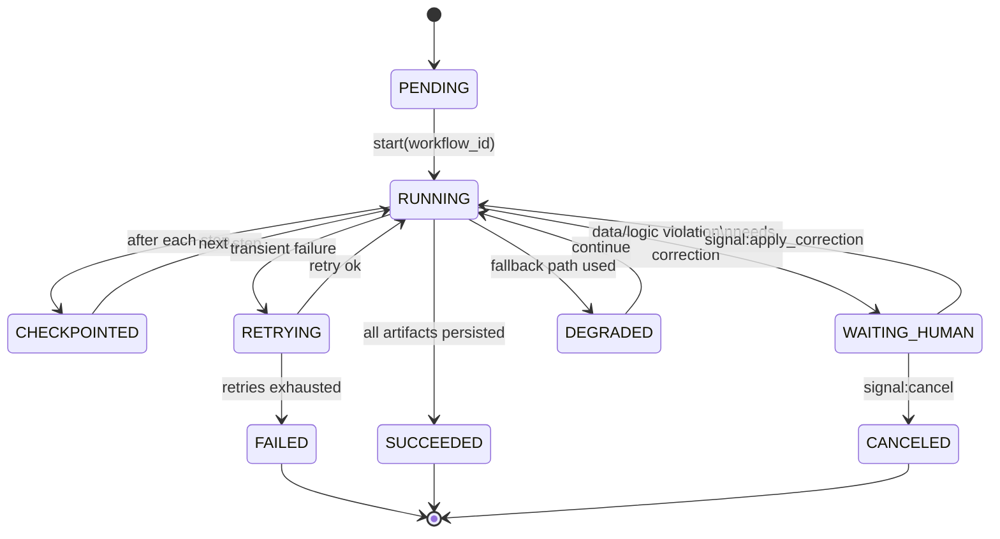
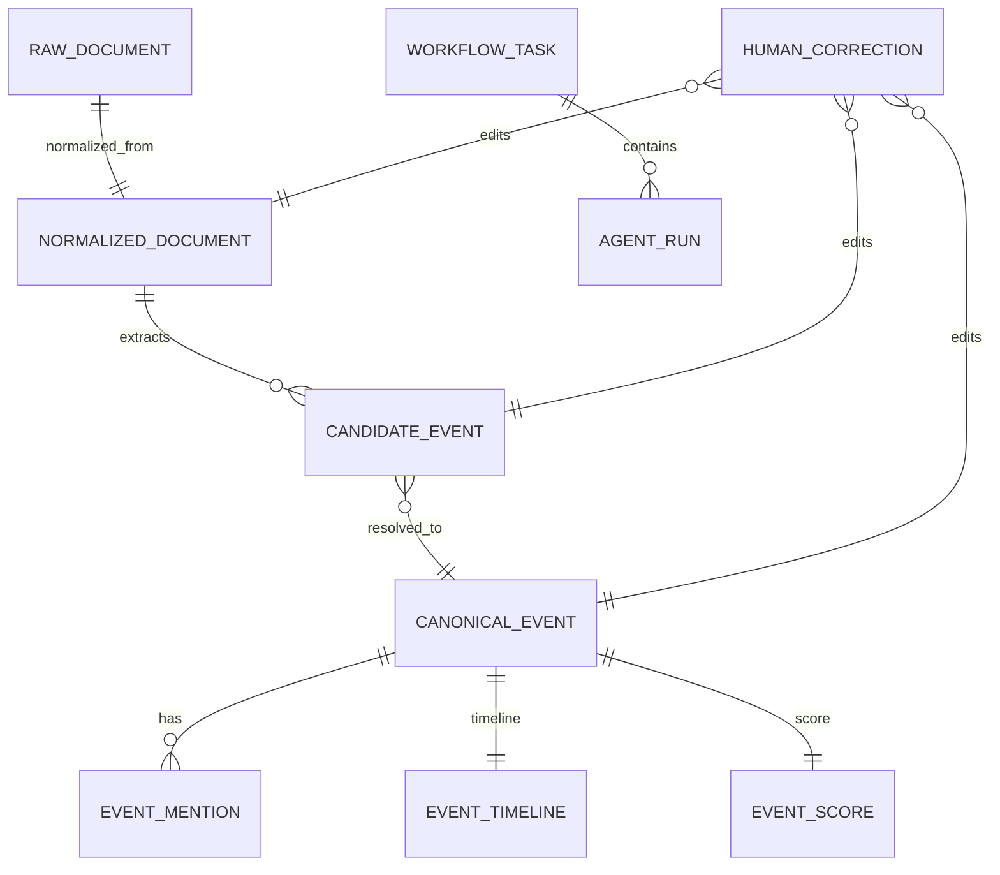

# 全 Agent 工程化运行 A 股事件认知与复盘系统 Stage One 设计报告

## 执行摘要

Stage One 的目标不是“做一个产品界面”，而是把 **A 股个人投研的最小闭环引擎**（资讯过滤 → 事件归一 → 动态跟踪 → 日终复盘）以 **Durable Workflow + 可审计对象模型** 的形式跑稳，做到每天自动产出你能直接用于复盘的结果，并能通过人工校正反哺 Agent 规则。该阶段采用 **All‑Agent Engineering**：创始人只做“定义标准 + 验收 + 训练/纠偏”，其余包括需求拆解、架构、编码、测试、运维、合规守门、评估回归均由 Agent 完成，并把每次运行沉淀为可复用的 Skill/Workflow 资产，为后续平台化（模板生态）打地基。

推荐的工程化底座是：

- **Temporal** 作为“外层耐久编排”：提供 Workflow Execution 的 durable/replay 机制、Activity 级重试策略、Schedules、Signals/Queries/Updates 等能力，适合长链路和可恢复执行。citeturn1search10turn0search7turn0search4turn4search2turn4search9  
- **LangGraph** 作为“内层推理图”：把 LLM 相关的抽取/总结流程建成 stateful graph，并使用 checkpointer 做步骤级 checkpoint，便于 fault-tolerance 与 human‑in‑the‑loop。citeturn1search1turn0search1turn4search10  
- **Postgres** 作为 system-of-record（对象真相库），**Redis** 用于缓存/锁/短期队列（如需要），向量检索优先 **pgvector**（简单同库），后续再扩到 **Qdrant**（更强 payload filtering / payload index）。citeturn0search3turn0search22turn1search8turn1search0turn5search2  
- **FastAPI** 提供最小控制面（触发/查询/校正），使用依赖注入与后台任务机制简化工程结构。citeturn0search5turn0search2  

合规策略必须“前置到系统级守门”，尤其是避免触碰投顾/荐股/走势预测等红线。监管文件明确要求媒体不得刊发未具备资质机构或个人对证券走势、可行性等分析预测建议类信息；并对以软件工具向客户提供投资建议/提示买卖时机等功能提出要求（说明来源、方法与局限、风险揭示等）。citeturn2view0  

本报告给出：

- Stage One 需要的 **全量 Agent 清单**（按 6 类：产品/需求、架构/设计、开发实现、质量保障、治理/合规、交付/运维），并按优先级排序  
- 每个 Agent 的工程规格：mission、I/O、涉及对象字段、工具栈、失败处理、幂等、审计 hooks、可量化成功标准  
- 4 条主工作流（触发/并行/重试/checkpoint 规则）与 Orchestrator 状态机  
- 关键数据对象的 **JSON Schema 合同**（RawDocument / NormalizedDocument / CandidateEvent / CanonicalEvent / …）  
- 每个 Agent 的自动化测试方案（unit / integration / e2e）、样例用例与指标  
- 单人 4–6 周的周计划（全部工作由 Agent 执行）+ 最小 CI/CD 与监控审计留存配置  
- Agent 定义模板（10 字段）与 6 个示例（Source/Event/Relevance/Summary/Compliance/Orchestrator）  
- 最小 FastAPI API 规格（触发、查询、人工校正）

---

## Stage One 架构与技术选型

### 技术选型原则

- **长链路必须耐久**：Workflow 需要持久化状态、可重放、可断点恢复；Temporal 的 Workflow Execution 以 event history 记录命令与事件并支持 replay，是典型 durable execution 方案。citeturn1search10turn9search0turn0search7  
- **编排必须确定性**：Temporal 明确要求 Workflow 代码遵守确定性约束（不得做网络 I/O、不得使用系统时间随机数等），把所有非确定性操作放到 Activities。citeturn9search4turn9search3  
- **LLM 推理要可 checkpoint + 可暂停**：LangGraph 支持将 graph state 作为 checkpoints 持久化，并支持 interrupts 进行人工介入。citeturn0search1turn4search10turn1search1  
- **对象模型优先**：所有中间产物都落到结构化对象（documents/events/mentions/timeline/scores/agent_runs），避免“只有文本没有真相”的黑箱。  

### 最小可运行系统形态

- **Temporal Server**（dev：temporal server start-dev；prod：Temporal 集群/Temporal Cloud）  
- **Temporal Worker**（Python）：运行 Workflows + Activities  
- **FastAPI 控制面**：触发任务、查询产物、写入人工校正  
- **Postgres**：对象库（documents/events/scores/timelines/agent_runs/tasks/corrections）  
- **Redis**：分布式锁、短期缓存（可选，先轻量）citeturn5search2  
- **Vector store**：先 pgvector（同库部署简单），后续需要更强过滤/索引再换 Qdrantciteturn0search3turn1search8turn1search0  

### Temporal vs Celery（Stage One 优先 Temporal）

- Temporal 提供 **Activity 超时/重试策略**，失败返回 Workflow 由其决定后续处理，适合“每步都可恢复”的投研链路。citeturn0search7turn0search4turn0search19  
- Temporal 支持 **Schedules**（官方推荐优先用 Schedules 而不是 Cron Job），可暂停/更新，适合你的定时抓取与日终复盘。citeturn4search2turn4search0  
- Celery 也能做任务队列，但幂等与 ack/retry 需要更谨慎配置；其文档明确指出任务应幂等时可用 acks_late 等策略。citeturn7search0turn7search13  

**结论**：Stage One 以“稳定链路”为王，Temporal 更贴合你的“可恢复、可审计、可长期运行”的目标。

### LangGraph vs LangChain（Stage One LLM 流程优先 LangGraph）

- LangGraph 的 Graph API 把流程建成 state + nodes + edges，并可在 compile 时挂 checkpointer 和 breakpoints。citeturn1search1turn1search5  
- LangGraph persistence 会在每一步保存 checkpoint，便于恢复与回溯。citeturn0search1  
- LangGraph interrupts 支持暂停等待外部输入，适合“人工校正后继续跑”。citeturn4search10  

### pgvector vs Qdrant（Stage One 默认 pgvector，预留切换）

- pgvector 是 Postgres 扩展，可在同库里存 embeddings 与相似度索引，易部署、事务一致性好。citeturn0search3turn0search22turn0search8  
- Qdrant 支持 payload filtering 与 payload indexes，可在“按股票/板块/时间过滤后再向量检索”场景更强。citeturn1search8turn1search0turn1search4  

---

## Stage One 全量 Agent 清单与工程规格

### Agent 分类（6 类）与优先级约定

- **P0**：Stage One 跑不起来/不可审计/不可合规就会失败的最小集合  
- **P1**：可显著提升质量与效率，但不影响“每天能跑出复盘结果”  

下面的列表把“运行期业务 Agent”和“工程期交付 Agent”统一纳入同一组织体系：你的系统既要 **跑投研链路**，也要 **全 Agent 化把它做出来**。

### Stage One 所需 Agent 总表

| 分类 | Agent | 优先级 | 运行角色 | 核心读写对象 |
|---|---|---:|---|---|
| 产品/需求 | ScopeKeeper（范围护栏） | P0 | 工程 | WorkflowTask、AgentRun |
| 产品/需求 | EvalPlanner（指标与标注协议） | P0 | 工程 | HumanCorrection、AgentRun |
| 架构/设计 | ContractArchitect（对象/接口契约） | P0 | 工程 | JSON Schemas、DB迁移 |
| 架构/设计 | WorkflowArchitect（Temporal/LangGraph 设计） | P0 | 工程 | WorkflowTask、AgentRun |
| 架构/设计 | PromptPolicyDesigner（Prompt/规则/合规模板） | P0 | 工程 | 合规规则、Prompt模板 |
| 开发实现 | Orchestrator Agent（总控） | P0 | 运行期 | WorkflowTask、AgentRun |
| 开发实现 | Source Agent（抓取） | P0 | 运行期 | RawDocument |
| 开发实现 | Normalize Agent（清洗标准化） | P0 | 运行期 | NormalizedDocument |
| 开发实现 | Dedup Agent（去重聚类） | P0 | 运行期 | NormalizedDocument、AgentRun |
| 开发实现 | EntityLink Agent（实体/证券映射） | P0 | 运行期 | CandidateEvent.participants |
| 开发实现 | EventExtract Agent（事件抽取） | P0 | 运行期 | CandidateEvent |
| 开发实现 | EventResolve Agent（事件归一） | P0 | 运行期 | CanonicalEvent、EventMention |
| 开发实现 | RelevanceScore Agent（排序打分） | P0 | 运行期 | EventScore |
| 开发实现 | TimelineState Agent（状态机/时间线） | P0 | 运行期 | EventTimeline、CanonicalEvent.state |
| 开发实现 | SummaryReplay Agent（日终复盘生成） | P0 | 运行期 | Report（可落库）、CanonicalEvent.summary |
| 质量保障 | CodeReview Agent | P0 | 工程 | PR评审产物 |
| 质量保障 | Test Agent（单测/集成/E2E） | P0 | 工程 | 测试报告、覆盖率 |
| 质量保障 | RegressionEval Agent（回归评估） | P1 | 工程+运行期 | 指标看板 |
| 治理/合规 | ComplianceGuard Agent（合规守门） | P0 | 运行期 | 合规审计记录 |
| 治理/合规 | AuditTrace Agent（可追溯/留痕） | P0 | 运行期 | AgentRun、WorkflowTask |
| 治理/合规 | SecuritySecrets Agent（密钥/权限） | P1 | 工程 | Secret清单、权限策略 |
| 交付/运维 | DevOpsRelease Agent | P0 | 工程 | Docker/部署脚本 |
| 交付/运维 | MonitoringAlert Agent | P1 | 工程+运行期 | 指标/告警 |

---

### 全 Agent 通用工程约束（所有 Agent 共享）

**失败处理统一分级**  
- Transient（网络超时/限流/临时 5xx）：自动重试（指数退避 + 抖动），最多 N 次  
- Data（解析失败/字段缺失）：降级（保留原文 + 标记失败原因），不无限重试  
- Logic（非确定性/断言失败）：Fail-fast，进入 WAITING_HUMAN（需要人工校正或修复规则）  
Temporal 支持在 Activity 上配置超时与重试策略；Workflow 决定如何处理 Activity 失败。citeturn0search7turn0search4turn0search19  

**幂等统一规则**  
- 每个写入对象都有 **idempotency_key**（哈希）并在 Postgres 上用 UNIQUE + UPSERT  
- Temporal 侧以 workflow_id + run_id 作为强幂等边界（重复触发同一 workflow_id 时先检查是否已存在运行或已完成）  

**审计与日志统一 hooks**  
- 每次 Agent 执行都必须落一条 `AgentRun`（输入引用、输出引用、耗时、错误、重试次数、模型版本/规则版本）  
- 每次 Workflow 创建/推进都必须落一条 `WorkflowTask`（状态机、checkpoint、失败原因）  
- 对外展示内容必须可溯源（source_ref + evidence_spans）  
（这也与监管文件强调的“留痕管理”方向一致。citeturn2view0）

---

### 单 Agent 规格卡片（逐一给出）

下面按“你真正需要实现/运行”的粒度给规格。为避免重复，每个 Agent 的“失败分级/审计 hooks/幂等”默认遵循上面的通用约束，仅列出特殊点。

#### ScopeKeeper Agent（产品/需求）

- Mission：把 Stage One 需求压成可执行 P0；拒绝任何越界需求；输出本周 Agent backlog 与验收门槛  
- Inputs：当前 backlog、Issue 列表、上一轮验收结果（RegressionEval 输出）  
- Outputs：`WeeklyBacklog`（可作为 WorkflowTask.metadata）、“拒绝清单”（Beta 池）  
- Schema（fields）：`{week, goals[], non_goals[], risks[], acceptance_criteria[]}`  
- Tools：LLM（文本生成）、GitHub API（可选）  
- 特殊失败处理：若出现冲突（同功能被列为 P0+禁区），必须阻断并要求人确认  
- 成功标准：每周新增 P0 ≤ 5 个；P0 变更率（本周新增/删除）≤ 20%

#### EvalPlanner Agent（产品/需求）

- Mission：制定“核心指标验收协议”，并把人工校正样本沉淀为评估集（golden set）；驱动 RegressionEval  
- Inputs：HumanCorrection、AgentRun.metrics、抽样原文/事件对  
- Outputs：`EvalDataset`（JSONL）、`EvalReportSpec`（指标/样本量/频率）  
- Tools：LLM（生成标注指南）、Postgres、对象存储（JSONL）  
- 特殊幂等：同一 correction_id 只能进入评估集一次（UNIQUE）  
- 成功标准：每周评估集增长 ≥ 100 条；关键字段一致性（标注规则遵循度）≥ 95%

#### ContractArchitect Agent（架构/设计）

- Mission：定义并维护所有关键对象的 JSON Schema 合同与 DB 迁移；确保 API/Agents 使用同一契约  
- Inputs：对象需求、变更请求  
- Outputs：JSON Schema 文件、Alembic migrations  
- Tools：Pydantic 生成 JSON Schema（支持 draft 2020-12 / OpenAPI 3.1）citeturn5search0、Alembicciteturn5search3、SQLAlchemyciteturn5search1  
- 特殊失败处理：任何 breaking change 必须走版本化（schema_version++，旧字段保留 deprecated）  
- 成功标准：OpenAPI 校验通过；迁移可前进/回滚；契约变更导致的运行期错误为 0

#### WorkflowArchitect Agent（架构/设计）

- Mission：把 4 条主工作流用 Temporal Workflows/Activities 表达出来；定义重试/超时/checkpoint/human gate  
- Inputs：Agent 清单与 I/O 契约、SLA（抓取频率/日终时间）  
- Outputs：Temporal Workflow/Activity 设计稿（超时/重试策略表），Orchestrator 状态机  
- Tools：Temporal docs（Schedules/Retry Policies/Message Passing）citeturn4search2turn0search4turn4search1turn4search9  
- 关键约束：Workflow 代码必须确定性（禁止网络 I/O、禁止系统时间），所有外部调用放 Activitiesciteturn9search4  
- 成功标准：任一 Activity 失败可重试；Workflow 可恢复；同一 workflow_id 重复触发不会重复写数据

#### PromptPolicyDesigner Agent（架构/设计）

- Mission：为 LLM‑based Agents（EventExtract/Summary/EntityLink 部分能力）制定 JSON‑only 输出 prompt、证据规则、风险分级模板、敏感词策略  
- Inputs：事件类型字典、合规红线、历史错误样本  
- Outputs：Prompt 模板库（版本化），合规模板（A/B/C 风险分级）  
- 合规依据：监管文件强调不得发布无资质的“分析、预测或建议类信息”，且软件工具若具备选股/提示买卖时机功能需说明方法与局限、数据来源等。citeturn2view0  
- 成功标准：LLM JSON 解析成功率 ≥ 99%；“证据片段来自原文”比例 = 100%；敏感词漏检率 = 0（以 ComplianceGuard 测试集为准）

#### Orchestrator Agent（开发实现，运行期总控）

- Mission：以 Temporal Workflow 形式调度 4 条主流程；维护 WorkflowTask 状态机；实现 retries/checkpoints/降级/人工介入  
- Inputs：触发参数（时间窗、sources、dry_run、force_recompute、watchlist（阶段一可固定））  
- Outputs：WorkflowTask、AgentRun 聚合、最终产物（events/scores/timeline/report）  
- Tools/APIs：Temporal Workflows/Activities/Worker；Schedules；Signals/Queries/Updatesciteturn4search2turn4search9turn4search1turn4search4  
- 失败处理：  
  - Activity transient：自动重试（RetryPolicy）citeturn0search4turn0search7  
  - Data/Logic：进入 WAITING_HUMAN（发出 signal 给 FastAPI 控制面）  
- 幂等：workflow_id = `{workflow_name}:{date}:{window}:{env}`；所有写操作按对象 key UPSERT  
- 审计 hooks：每个 Activity 前后写 AgentRun；每个阶段 checkpoint 写 WorkflowTask.checkpoints  
- 成功标准（可量化）：  
  - 每日 1 次全链路成功率 ≥ 99%（7 天游程）  
  - 任一中断后可从最近 checkpoint 继续（人工验证 ≥ 10 次）  
  - 端到端时延（抓取→复盘）≤ 60 分钟（阶段一内部版可放宽）

#### Source Agent（开发实现，执行）

- Mission：从合规来源抓取 A 股公告/互动/快讯/公开资讯元数据，生成 RawDocument  
- Inputs：`{source_configs[], time_window, cursor_state}`  
- Outputs：RawDocument[]（入库）  
- 数据字段（主要）：source_name/source_type/url/title/raw_text(or raw_html)/published_at/fetched_at/content_hash/http_status/metadata  
- Tools：httpx/requests；必要时 Playwright（仅在允许范围）；Postgres；对象存储（可选）  
- 失败处理：  
  - 429/5xx：重试  
  - 解析失败：保留 raw_html + 标记 parse_error  
- 幂等：`raw_doc_key = sha256(source_name + url + published_at + title)`；UNIQUE(raw_doc_key)  
- 审计 hooks：抓取批次写 AgentRun.metrics（success_count/fail_count）  
- 成功标准：抓取成功率 ≥ 99%；重复入库率 ≤ 1%；平均抓取耗时（每 100 条）≤ 30 秒

#### Normalize Agent（开发实现，执行）

- Mission：清洗 raw_html/噪音，统一时间/来源字段，生成 NormalizedDocument（可直接供抽取）  
- Inputs：RawDocument[]  
- Outputs：NormalizedDocument[]（入库），DroppedList（低质/空文）  
- Tools：BeautifulSoup/lxml（解析）、正则规则库、Postgres  
- 幂等：`norm_key = sha256(raw_document_id + clean_content_sha256)`；UPSERT  
- 成功标准：时间/来源标准化 = 100%；空文/垃圾过滤率 ≥ 90%；清洗后长度分布无异常（P50/95 监控）

#### Dedup Agent（开发实现，执行）

- Mission：在事件抽取前做文档级去重/聚类，减少重复传播  
- Inputs：NormalizedDocument[]（在 time_window 内）  
- Outputs：`unique_doc_ids[]`、`duplicate_clusters[]`（写入 metadata 或独立表）  
- Tools：hash + 相似度（可选 embeddings）；pgvector/Qdrant（P1）citeturn0search3turn1search8  
- 幂等：cluster_id = sha256(sorted(doc_ids))  
- 成功标准：去重准确率 ≥ 95%（按 EvalPlanner 抽样协议）；误杀率 ≤ 2%

#### EntityLink Agent（开发实现，执行）

- Mission：从文档中识别公司/股票/板块/题材关键词并映射证券代码（最小可用：词典 + 规则）  
- Inputs：NormalizedDocument（text + title）  
- Outputs：`entities[]`（写入 CandidateEvent.participants 或单独 entity_links 表）  
- Schema（fields）：`{name,type,stock_code,sector,tags,confidence,evidence_span}`  
- Tools：本地证券词典（symbol master）、模糊匹配、LLM（P1 纠错）  
- 幂等：entity_link_key = sha256(doc_id + stock_code + span)  
- 成功标准：股票映射准确率 ≥ 95%；召回率 ≥ 90%（对 watchlist 标的）

#### EventExtract Agent（开发实现，执行）

- Mission：把文档转成 CandidateEvent（事件类型、主体/动作/客体、时间、证据片段）  
- Inputs：NormalizedDocument + entity_links  
- Outputs：CandidateEvent[]  
- Tools：LLM + LangGraph 子图（抽取→校验→修复→JSON 输出），LangGraph persistence/checkpointerciteturn1search1turn0search1  
- 特殊失败处理：  
  - JSON 无法解析：进入修复节点最多 2 次；仍失败则降级为 “UNCLASSIFIED” + 证据片段  
- 幂等：candidate_event_key = sha256(doc_id + event_type + subject + action + object + event_time)  
- 审计 hooks：记录 prompt_version、model、tokens、json_parse_success  
- 成功标准：事件抽取准确率 ≥ 90%；证据片段来自原文比例 = 100%；JSON 解析成功率 ≥ 99%

#### EventResolve Agent（开发实现，执行）

- Mission：将多来源 CandidateEvent 归一为 CanonicalEvent，并生成 EventMention；维护 first_seen/last_seen  
- Inputs：CandidateEvent[]（时间窗内）+ 历史 CanonicalEvent（最近 N 天）  
- Outputs：CanonicalEvent（UPSERT）、EventMention（INSERT）  
- Tools：规则指纹（canonical_key）+（可选）向量相似检索；pgvector/Qdrantciteturn0search3turn1search0  
- 幂等：  
  - canonical_key = sha256(event_type + normalized(subject/object) + time_bucket + key_entities)  
  - mention_key = sha256(canonical_event_id + doc_id)  
- 成功标准：归一准确率 ≥ 90%；同一 canonical_event 同一来源 mention 不重复；信息不丢失（mentions 覆盖率 100%）

#### RelevanceScore Agent（开发实现，执行）

- Mission：对 CanonicalEvent 打分排序（规则透明），输出 EventScore（含分项）  
- Inputs：CanonicalEvent + watchlist + source_trust_table + freshness_context  
- Outputs：EventScore（UPSERT），并回写 CanonicalEvent.importance_score  
- Tools：规则引擎（Python），必要时 LLM 仅用于解释文本，不用于决定分数  
- 幂等：score_key = sha256(event_id + scoring_rule_version + scoring_time_bucket)  
- 成功标准：Top3 匹配度 ≥ 90%（对人工标注）；分数可解释（每个分项都有 reason_code）；分数漂移监控（P95 变化阈值）

#### TimelineState Agent（开发实现，执行）

- Mission：维护事件状态机与时间线条目（NEW/VERIFIED/RISING/REIGNITED/REALIZED），写 EventTimeline  
- Inputs：CanonicalEvent + EventMention + EventScore + 历史 EventTimeline  
- Outputs：EventTimeline（append entries），更新 CanonicalEvent.state  
- Tools：规则状态机；Temporal message passing（可接人工 signal 强制修正状态）citeturn4search9turn4search1  
- 幂等：timeline_entry_key = sha256(event_id + entry_type + changed_at + trigger_doc_id)  
- 成功标准：状态判定准确率 ≥ 95%；时间顺序正确 = 100%；状态变更原因可追溯（reason_code 覆盖率 100%）

#### SummaryReplay Agent（开发实现，执行）

- Mission：生成日终复盘（结构化 + 可溯源 + 合规声明），并产出“今日重点事件卡片”  
- Inputs：TopN ranked events + timelines + mentions（可按 watchlist 聚合）  
- Outputs：`DailyReport`（可落库为 report 表/或对象存储 JSON），事件级摘要回写 CanonicalEvent.summary  
- Tools：LLM + LangGraph（摘要→证据核对→合规模板化），强制 JSON/模板输出  
- 幂等：report_key = sha256(report_date + tenant_id + template_version)  
- 成功标准：生成耗时 ≤ 30 秒（单人 Stage One 可放宽到 ≤ 2 分钟）；合规拦截 0 漏检；每条结论带 source_ref

#### ComplianceGuard Agent（治理/合规，运行期守门）

- Mission：对所有 user‑facing 文本做事前拦截、事中模板约束、事后审计；阻断任何“荐股/预测/买卖点/收益承诺/引导决策”内容  
- Inputs：SummaryReplay 输出（cards/report），以及系统对外返回的任意文本  
- Outputs：ApprovedContent / BlockedContent + ComplianceLog  
- Tools：敏感词/正则/分类器；监管约束库（规则版本化）  
- 合规依据：媒体不得发布无资质主体对证券走势/可行性分析预测建议信息；软件工具如提示买卖时机需说明方法/局限与来源等。citeturn2view0  
- 幂等：content_hash = sha256(text + template_version)  
- 成功标准：违规拦截率 = 100%（以测试集 + 全量抽样）；误杀率 ≤ 3%（可通过白名单修正）；合规声明植入率 = 100%

#### AuditTrace Agent（治理/合规，运行期留痕）

- Mission：把“谁在何时用什么输入产出什么输出”强制落库；提供一键追溯链（event → mentions → docs → source）  
- Inputs：所有 Agents 的 before/after hooks  
- Outputs：AgentRun、WorkflowTask、TraceChain（可计算视图）  
- Tools：Postgres；OpenTelemetry tracing（可选）citeturn6search3turn6search0  
- 成功标准：抽样 100 条事件追溯链可用率 = 100%；失败任务定位时间 ≤ 5 分钟（通过日志字段齐全）

#### CodeReview Agent（质量保障）

- Mission：对工程 Agents 产出的代码变更做结构化 review（安全、幂等、可测试、可维护）  
- Inputs：PR diff、测试结果、契约变更  
- Outputs：ReviewReport（blocking/non‑blocking）、必须修改项清单  
- Tools：LLM（review）、静态检查（ruff/mypy）、安全扫描（bandit 等）  
- 成功标准：主分支 CI 失败率 ≤ 5%；线上/内测回滚次数为 0（Stage One 可用本地回滚）

#### Test Agent（质量保障）

- Mission：为每个运行期 Agent 建 unit/integration/e2e；把“指标验收协议”自动化  
- Inputs：契约、样例数据、EvalDataset  
- Outputs：pytest 报告、覆盖率、端到端健康报告  
- Tools：pytest、requests-mock/vcrpy（抓取录制）、Temporal test utils（见 Temporal 测试指南入口）citeturn9search6  
- 成功标准：P0 Agents 单测覆盖率 ≥ 70%；E2E 每日通过率 ≥ 99%

#### DevOpsRelease Agent（交付/运维）

- Mission：把系统打包成可重复部署（local→staging→prod），提供一键启动 Temporal/Postgres/Worker/API  
- Inputs：repo、环境变量模板、端口规划  
- Outputs：docker-compose.yml、Dockerfile、部署脚本、回滚策略  
- Tools：Docker、GitHub Actions、迁移脚本（Alembic）citeturn5search3  
- 成功标准：新机器 30 分钟内可拉起全套服务；迁移可回滚；版本发布可审计（tag+changelog）

#### RegressionEval / MonitoringAlert / SecuritySecrets（P1）

- RegressionEval：每晚对 EvalDataset 跑回归，输出指标趋势，若退化则阻断发布  
- MonitoringAlert：接 Prometheus metrics（prometheus-client）与 Sentry/Otel，做告警citeturn6search5turn6search2turn6search0  
- SecuritySecrets：密钥最小权限、隔离环境变量、轮换制度（与 OpenClaw 等 agent 平台近期安全事件的行业经验一致，应前置安全治理）citeturn8news32turn8search0  

---

## 工作流编排与 Orchestrator 状态机

### 四条主工作流

下面的 4 条工作流对应 Stage One 的最小闭环；全部建议用 Temporal Workflows 编排，Activities 执行业务 Agent。

```mermaid
flowchart TD
  T1[Schedule/Manual Trigger] --> O[Orchestrator Workflow]

  subgraph W1[Workflow A: Ingest]
    O -->|parallel by source| S1[Source Agent]
    S1 --> N1[Normalize Agent]
    N1 --> D1[Dedup Agent]
  end

  subgraph W2[Workflow B: Build Events]
    D1 --> E1[EntityLink Agent]
    E1 --> X1[EventExtract Agent\n(LangGraph sub-graph)]
    X1 --> R1[EventResolve Agent]
  end

  subgraph W3[Workflow C: Score & Timeline]
    R1 --> SC[RelevanceScore Agent]
    SC --> TL[TimelineState Agent]
  end

  subgraph W4[Workflow D: End-of-day Replay]
    TL --> SR[SummaryReplay Agent\n(LangGraph sub-graph)]
    SR --> CG[ComplianceGuard Agent]
    CG --> AT[AuditTrace Agent]
  end

  AT --> DONE[Artifacts persisted\n(Postgres/ObjectStore)]
```

Temporal 的 **Schedules** 用于定时触发抓取/复盘；官方建议优先用 Schedules 而非 Cron Jobs，且 Schedules 可更新/暂停。citeturn4search2turn4search0  

### 触发、并行与重试策略

- Workflow A（Ingest）  
  - Trigger：每 5–15 分钟一次（Stage One 可先每小时）+ 手工触发  
  - Parallelism：按 source 并行（每个 source 一个 Activity batch）；按 doc 分片并行（可选）  
  - Retry：抓取 Activity 重试（max_attempts=5，指数退避）citeturn0search4turn0search7  
  - Checkpoint：每个 source 完成写 `WorkflowTask.checkpoints["source:{name}"]=last_cursor`  

- Workflow B（Build Events）  
  - Trigger：Workflow A 完成后自动触发（child workflow）  
  - Parallelism：按 doc_id map‑reduce（LangGraph 支持 map‑reduce patterns；也可 Temporal fan‑out）citeturn1search5  
  - Retry：LLM 抽取失败允许“内部自修复 2 次 + Activity 重试 2 次”；超过进入 WAITING_HUMAN  

- Workflow C（Score & Timeline）  
  - Trigger：Workflow B 输出 canonical_events 后  
  - Parallelism：按 event_id 并行打分（可批量）  
  - Retry：纯规则计算一般不重试；DB 冲突/锁冲突短重试  

- Workflow D（End-of-day Replay）  
  - Trigger：收盘后定时（如 16:30）或手工触发  
  - Retry：Summary 失败先降级（只输出结构化 facts + timelines，不做解释段）  
  - Gate：必须经过 ComplianceGuard 才能对外返回  

### Orchestrator 状态机



Temporal 支持 Signals/Queries/Updates：  
- Query 用于读取 workflow 状态；Signal 用于异步写入；Update 用于同步“写入并等待处理完成”的请求。citeturn4search3turn4search4turn4search9  

---

## 数据对象契约与实体关系

### 对象关系图



### 关键对象 JSON Schema（单文件 $defs 版本）

> 实现建议：用 **Pydantic v2** 定义 BaseModel，再自动生成 JSON Schema（draft 2020‑12 / OpenAPI 3.1）。citeturn5search0  

```json
{
  "$schema": "https://json-schema.org/draft/2020-12/schema",
  "$id": "https://example.local/schemas/stage1-contracts.json",
  "title": "StageOneContracts",
  "type": "object",
  "$defs": {
    "Ref": {
      "type": "object",
      "properties": {
        "kind": { "type": "string" },
        "id": { "type": "string" }
      },
      "required": ["kind", "id"],
      "additionalProperties": false
    },
    "RawDocument": {
      "type": "object",
      "properties": {
        "raw_document_id": { "type": "string", "description": "UUID" },
        "schema_version": { "type": "string", "default": "1.0" },
        "source_name": { "type": "string" },
        "source_type": { "type": "string", "enum": ["announcement", "irm", "newsflash", "public_meta"] },
        "url": { "type": "string" },
        "title": { "type": "string" },
        "raw_text": { "type": ["string", "null"] },
        "raw_html": { "type": ["string", "null"] },
        "published_at": { "type": "string", "format": "date-time" },
        "fetched_at": { "type": "string", "format": "date-time" },
        "raw_doc_key": { "type": "string", "description": "sha256 idempotency key" },
        "content_sha256": { "type": "string" },
        "http_status": { "type": ["integer", "null"] },
        "language": { "type": ["string", "null"] },
        "metadata": { "type": "object" }
      },
      "required": ["raw_document_id", "source_name", "source_type", "url", "title", "published_at", "fetched_at", "raw_doc_key", "content_sha256", "metadata"],
      "additionalProperties": false
    },
    "NormalizedDocument": {
      "type": "object",
      "properties": {
        "normalized_document_id": { "type": "string" },
        "schema_version": { "type": "string", "default": "1.0" },
        "raw_document_id": { "type": "string" },
        "clean_title": { "type": "string" },
        "clean_content": { "type": "string" },
        "normalized_source": { "type": "string" },
        "normalized_time": { "type": "string", "format": "date-time" },
        "quality_score": { "type": "number", "minimum": 0, "maximum": 1 },
        "clean_content_sha256": { "type": "string" },
        "segments": {
          "type": "array",
          "items": { "type": "string" }
        },
        "dropped_reason": { "type": ["string", "null"] },
        "metadata": { "type": "object" }
      },
      "required": ["normalized_document_id", "raw_document_id", "clean_title", "clean_content", "normalized_source", "normalized_time", "quality_score", "clean_content_sha256", "segments", "metadata"],
      "additionalProperties": false
    },
    "Participant": {
      "type": "object",
      "properties": {
        "name": { "type": "string" },
        "type": { "type": "string", "enum": ["company", "stock", "sector", "theme", "person", "policy", "product"] },
        "stock_code": { "type": ["string", "null"] },
        "tags": { "type": "array", "items": { "type": "string" } },
        "confidence": { "type": "number", "minimum": 0, "maximum": 1 },
        "evidence_span": {
          "type": "object",
          "properties": {
            "start": { "type": "integer" },
            "end": { "type": "integer" },
            "text": { "type": "string" }
          },
          "required": ["start", "end", "text"],
          "additionalProperties": false
        }
      },
      "required": ["name", "type", "confidence", "tags", "evidence_span"],
      "additionalProperties": false
    },
    "CandidateEvent": {
      "type": "object",
      "properties": {
        "candidate_event_id": { "type": "string" },
        "schema_version": { "type": "string", "default": "1.0" },
        "normalized_document_id": { "type": "string" },
        "event_type": {
          "type": "string",
          "enum": ["announcement_disclosure", "order_coop", "policy_catalyst", "earnings", "product_tech", "research_visit", "price_supply", "risk_regulatory", "sector_spread", "old_news_repeat", "unclassified"]
        },
        "event_time": { "type": "string", "format": "date-time" },
        "headline": { "type": "string" },
        "subject": { "type": ["string", "null"] },
        "action": { "type": ["string", "null"] },
        "object": { "type": ["string", "null"] },
        "participants": { "type": "array", "items": { "$ref": "#/$defs/Participant" } },
        "evidence_spans": {
          "type": "array",
          "items": {
            "type": "object",
            "properties": {
              "start": { "type": "integer" },
              "end": { "type": "integer" },
              "text": { "type": "string" }
            },
            "required": ["start", "end", "text"],
            "additionalProperties": false
          }
        },
        "confidence": { "type": "number", "minimum": 0, "maximum": 1 },
        "candidate_event_key": { "type": "string" },
        "extraction": {
          "type": "object",
          "properties": {
            "model": { "type": "string" },
            "prompt_version": { "type": "string" },
            "latency_ms": { "type": "integer" }
          },
          "required": ["model", "prompt_version", "latency_ms"],
          "additionalProperties": false
        },
        "metadata": { "type": "object" }
      },
      "required": ["candidate_event_id", "normalized_document_id", "event_type", "event_time", "headline", "participants", "evidence_spans", "confidence", "candidate_event_key", "extraction", "metadata"],
      "additionalProperties": false
    },
    "CanonicalEvent": {
      "type": "object",
      "properties": {
        "event_id": { "type": "string" },
        "schema_version": { "type": "string", "default": "1.0" },
        "canonical_key": { "type": "string" },
        "event_type": { "type": "string" },
        "first_seen_at": { "type": "string", "format": "date-time" },
        "last_seen_at": { "type": "string", "format": "date-time" },
        "state": { "type": "string", "enum": ["NEW", "VERIFIED", "RISING", "REIGNITED", "REALIZED"] },
        "importance_score": { "type": "number" },
        "primary_participants": { "type": "array", "items": { "$ref": "#/$defs/Participant" } },
        "summary": { "type": ["string", "null"] },
        "metadata": { "type": "object" }
      },
      "required": ["event_id", "canonical_key", "event_type", "first_seen_at", "last_seen_at", "state", "importance_score", "primary_participants", "metadata"],
      "additionalProperties": false
    },
    "EventMention": {
      "type": "object",
      "properties": {
        "mention_id": { "type": "string" },
        "schema_version": { "type": "string", "default": "1.0" },
        "event_id": { "type": "string" },
        "candidate_event_id": { "type": "string" },
        "normalized_document_id": { "type": "string" },
        "mention_time": { "type": "string", "format": "date-time" },
        "source_name": { "type": "string" },
        "evidence_spans": { "type": "array", "items": { "type": "string" } },
        "mention_key": { "type": "string" },
        "metadata": { "type": "object" }
      },
      "required": ["mention_id", "event_id", "candidate_event_id", "normalized_document_id", "mention_time", "source_name", "mention_key", "metadata"],
      "additionalProperties": false
    },
    "EventScore": {
      "type": "object",
      "properties": {
        "event_id": { "type": "string" },
        "schema_version": { "type": "string", "default": "1.0" },
        "scoring_rule_version": { "type": "string" },
        "computed_at": { "type": "string", "format": "date-time" },
        "components": {
          "type": "object",
          "properties": {
            "watchlist_relevance": { "type": "number" },
            "source_trust": { "type": "number" },
            "freshness": { "type": "number" },
            "novelty_first_disclosure": { "type": "number" },
            "market_reaction": { "type": "number" },
            "old_news_repeat": { "type": "number" }
          },
          "required": ["watchlist_relevance", "source_trust", "freshness", "novelty_first_disclosure", "market_reaction", "old_news_repeat"],
          "additionalProperties": false
        },
        "final_score": { "type": "number" },
        "reasons": { "type": "array", "items": { "type": "string" } },
        "score_key": { "type": "string" }
      },
      "required": ["event_id", "scoring_rule_version", "computed_at", "components", "final_score", "reasons", "score_key"],
      "additionalProperties": false
    },
    "EventTimeline": {
      "type": "object",
      "properties": {
        "event_id": { "type": "string" },
        "schema_version": { "type": "string", "default": "1.0" },
        "entries": {
          "type": "array",
          "items": {
            "type": "object",
            "properties": {
              "entry_id": { "type": "string" },
              "entry_time": { "type": "string", "format": "date-time" },
              "entry_type": { "type": "string", "enum": ["MENTION", "STATE_CHANGE", "NOTE"] },
              "state_from": { "type": ["string", "null"] },
              "state_to": { "type": ["string", "null"] },
              "trigger_ref": { "$ref": "#/$defs/Ref" },
              "reason_code": { "type": "string" },
              "timeline_entry_key": { "type": "string" }
            },
            "required": ["entry_id", "entry_time", "entry_type", "trigger_ref", "reason_code", "timeline_entry_key"],
            "additionalProperties": false
          }
        }
      },
      "required": ["event_id", "entries"],
      "additionalProperties": false
    },
    "AgentRun": {
      "type": "object",
      "properties": {
        "agent_run_id": { "type": "string" },
        "agent_name": { "type": "string" },
        "agent_category": { "type": "string" },
        "workflow_id": { "type": "string" },
        "task_id": { "type": "string" },
        "idempotency_key": { "type": "string" },
        "status": { "type": "string", "enum": ["PENDING", "RUNNING", "SUCCEEDED", "FAILED", "SKIPPED", "DEGRADED"] },
        "started_at": { "type": "string", "format": "date-time" },
        "ended_at": { "type": ["string", "null"], "format": "date-time" },
        "input_refs": { "type": "array", "items": { "$ref": "#/$defs/Ref" } },
        "output_refs": { "type": "array", "items": { "$ref": "#/$defs/Ref" } },
        "metrics": { "type": "object" },
        "error": { "type": ["object", "null"] },
        "retry_count": { "type": "integer" },
        "trace_id": { "type": ["string", "null"] }
      },
      "required": ["agent_run_id", "agent_name", "agent_category", "workflow_id", "task_id", "idempotency_key", "status", "started_at", "input_refs", "output_refs", "metrics", "retry_count"],
      "additionalProperties": false
    },
    "WorkflowTask": {
      "type": "object",
      "properties": {
        "task_id": { "type": "string" },
        "workflow_name": { "type": "string" },
        "workflow_id": { "type": "string" },
        "status": { "type": "string", "enum": ["PENDING", "RUNNING", "CHECKPOINTED", "WAITING_HUMAN", "RETRYING", "FAILED", "SUCCEEDED", "CANCELED", "DEGRADED"] },
        "created_at": { "type": "string", "format": "date-time" },
        "updated_at": { "type": "string", "format": "date-time" },
        "params": { "type": "object" },
        "checkpoints": { "type": "object" },
        "last_error": { "type": ["object", "null"] }
      },
      "required": ["task_id", "workflow_name", "workflow_id", "status", "created_at", "updated_at", "params", "checkpoints"],
      "additionalProperties": false
    },
    "HumanCorrection": {
      "type": "object",
      "properties": {
        "correction_id": { "type": "string" },
        "object_kind": { "type": "string", "enum": ["RawDocument", "NormalizedDocument", "CandidateEvent", "CanonicalEvent", "EventScore", "EventTimeline"] },
        "object_id": { "type": "string" },
        "field_path": { "type": "string", "description": "JSONPointer-like path" },
        "old_value": {},
        "new_value": {},
        "reason": { "type": "string" },
        "corrected_at": { "type": "string", "format": "date-time" },
        "corrected_by": { "type": "string", "default": "founder" },
        "linked_agent_run_id": { "type": ["string", "null"] },
        "used_for_training": { "type": "boolean", "default": true }
      },
      "required": ["correction_id", "object_kind", "object_id", "field_path", "new_value", "reason", "corrected_at"],
      "additionalProperties": false
    }
  },
  "additionalProperties": false
}
```

---

## 自动化测试计划与指标

### 测试分层原则

- **Unit**：单 Agent 的纯逻辑（解析/规则/幂等 key/状态机）  
- **Integration**：Agent + Postgres/Redis/VectorDB/LLM stub（请求/落库/UPSERT/锁）  
- **E2E**：Temporal workflow 端到端跑通（从触发到产出 report），并验证审计链  

Temporal 官方强调 Workflow/Activity/Worker 的核心构件；测试建议使用其 SDK 提供的 testing suite 与 replay 思路（安全部署亦强调 workflow determinism）。citeturn9search6turn9search3  

### 每个 P0 Agent 的必测项（简表）

| Agent | Unit 必测 | Integration 必测 | E2E 必测 | 关键指标 |
|---|---|---|---|---|
| Source | 解析器/分页/游标推进 | 录制 HTTP 响应落 RawDocument | ingest workflow | 抓取成功率≥99% |
| Normalize | HTML 清洗/时间标准化 | 规范化入库/UPSERT | ingest workflow | 标准化=100% |
| Dedup | hash/相似度阈值 | 聚类落库 | ingest→build | 去重准确率≥95% |
| EntityLink | 词典映射/同名处理 | doc→entities 写入 | build workflow | 映射准确率≥95% |
| EventExtract | JSON 校验/证据抽取 | LLM stub + LangGraph checkpoint | build workflow | 抽取准确率≥90% |
| EventResolve | canonical_key/merge logic | UPSERT canonical + mention | build workflow | 归一准确率≥90% |
| RelevanceScore | 分项权重/解释码 | score UPSERT | score workflow | Top3 匹配≥90% |
| TimelineState | 状态机转换规则 | timeline append 幂等 | score workflow | 状态准确≥95% |
| SummaryReplay | 模板渲染/引用检查 | LLM stub + 合规模板 | eod workflow | 生成耗时≤阈值 |
| ComplianceGuard | 敏感词/模式匹配 | 拦截+日志落库 | 任何对外输出链路 | 漏检=0 |
| AuditTrace | AgentRun/Task 写入 | trace chain 查询 | 全链路 | 追溯可用=100% |

### 样例测试用例（可直接转 pytest 参数化）

| 用例名 | 输入 | 期望输出 | 覆盖 |
|---|---|---|---|
| source_cninfo_timeout_retry | 模拟 504/timeout | Activity 重试≤5次后成功或失败入库 last_error | Source/RetryPolicy |
| normalize_empty_drop | raw_text 为空 | NormalizedDocument.dropped_reason 非空 | Normalize |
| dedup_near_duplicate | 两条新闻仅来源不同 | 聚为同 cluster，unique_doc_ids 只保留1 | Dedup |
| event_extract_json_invalid | LLM 返回非 JSON | LangGraph 修复≤2次；仍失败则 unclassified 降级 | EventExtract |
| resolve_false_merge_guard | 两事件主体不同但相似 | 不合并，canonical_key 不同 | EventResolve |
| compliance_buy_sell_block | 文本含“建议买入/目标价” | BlockedContent + log | ComplianceGuard |
| timeline_reignited_rule | 同事件隔 10 天再提及 | state 进入 REIGNITED + entry 记录 | TimelineState |
| audit_trace_chain | event_id 查询 | 返回 mentions→docs→sources 全链 | AuditTrace |
| workflow_resume_after_human | WAITING_HUMAN + correction | signal 后从 checkpoint 继续并成功 | Orchestrator |

---

## 单人 4–6 周 Stage One 开发路线与最小 CI/CD 运维

### 周粒度开发路线（所有工作由工程 Agents 执行，你只验收）

| 周 | 目标产物 | 主要执行 Agent | 验收点 |
|---|---|---|---|
| Week A | repo + 契约 + DB 迁移 + Temporal dev 环境 | ContractArchitect / DevOpsRelease / WorkflowArchitect | contracts 固定；docker-compose 一键起服务 |
| Week B | Workflow A 跑通：抓取→清洗→去重 | Source/Normalize/Dedup + Orchestrator + Test | 能稳定产生 NormalizedDocument；AgentRun/Task 有日志 |
| Week C | Workflow B 跑通：实体→事件抽取→归一 | EntityLink/EventExtract/EventResolve + ComplianceGuard（先接入） | CandidateEvent/CanonicalEvent 产生；证据=原文 |
| Week D | Workflow C/D 跑通：打分→状态→日终复盘 | RelevanceScore/TimelineState/SummaryReplay + ComplianceGuard + AuditTrace | 每天产出一份日终复盘 JSON；可追溯链可查 |
| Week E（可选） | 回归评估 + 监控 + 人工校正接口完善 | RegressionEval / MonitoringAlert / FastAPI 控制面 | 指标看板；人工校正能闭环并影响下一次输出 |
| Week F（可选） | 稳定性 hardening（7 天游程） | Orchestrator / DevOpsRelease / Test | 7 天全链路成功率 ≥ 99% |

### 最小 CI/CD 与运维配置

- **CI（GitHub Actions）**  
  - lint：ruff  
  - type：mypy  
  - test：pytest（unit+integration）  
  - build：Docker image  
  - contracts：OpenAPI/JSON Schema 校验（Pydantic 生成）citeturn5search0  

- **CD（最小）**  
  - staging：docker compose on a cheap VPS  
  - prod：同样 compose 或 k3s（等 Stage Two 再上 k8s）  
  - DB migration：Alembic upgrade head（可回滚）citeturn5search3  

- **监控/告警（P1，但建议 Week E 做）**  
  - FastAPI：OpenTelemetry instrumentationciteturn6search0  
  - Temporal：SDK 提供 OpenTelemetry interceptorciteturn6search3turn6search11  
  - Prometheus：prometheus-client 暴露 /metricsciteturn6search5turn6search9  
  - Sentry：FastAPI integrationciteturn6search2  
  - 审计留存：AgentRun/WorkflowTask/HumanCorrection ≥ 180 天（冷存储可用对象存储归档）

---

## API 控制面、Agent 模板与 Prompt / 合规附录

### FastAPI 最小 API 规格（Stage One 控制面）

> FastAPI 的依赖注入与 BackgroundTasks 机制可以帮助你把“控制面”与“运行期 worker”解耦，控制面只负责触发/查询，重活交给 Temporal。citeturn0search5turn0search2  

#### 触发工作流

**POST /v1/workflows/ingest**

```json
{
  "time_window": { "start": "2026-03-10T13:00:00Z", "end": "2026-03-10T14:00:00Z" },
  "sources": ["cninfo_announcement", "sse_announcement", "szse_notice", "irm"],
  "dry_run": false,
  "force_recompute": false
}
```

响应：

```json
{
  "task_id": "task_9b5c...",
  "workflow_id": "ingest:20260310:1300-1400:prod",
  "status": "PENDING"
}
```

**POST /v1/workflows/eod**

```json
{ "report_date": "2026-03-10", "dry_run": false }
```

#### 查询任务与产物

**GET /v1/tasks/{task_id}** → WorkflowTask

**GET /v1/events?date=2026-03-10&top_n=50** → CanonicalEvent + EventScore 摘要

**GET /v1/reports/eod?date=2026-03-10** → 日终复盘 JSON（已通过 ComplianceGuard）

#### 人工校正

**POST /v1/corrections**

```json
{
  "object_kind": "CanonicalEvent",
  "object_id": "event_123",
  "field_path": "/event_type",
  "old_value": "product_tech",
  "new_value": "policy_catalyst",
  "reason": "误分类：该事件核心为政策文件落地",
  "linked_agent_run_id": "run_abc"
}
```

响应：

```json
{ "correction_id": "corr_77f...", "accepted": true }
```

Orchestrator 可用 Temporal signal/update 接收“apply_correction”并从 WAITING_HUMAN 继续。citeturn4search9turn4search1turn4search4  

---

### Agent 定义模板（10 字段）

```json
{
  "name": "string",
  "category": "产品/需求 | 架构/设计 | 开发实现 | 质量保障 | 治理/合规 | 交付/运维",
  "mission": "string",
  "inputs": ["schema refs / objects"],
  "outputs": ["schema refs / objects"],
  "tools": ["LLM", "Temporal", "LangGraph", "Postgres", "Redis", "pgvector/Qdrant", "httpx", "..."],
  "rules": ["必须遵守的规则清单（合规/幂等/证据/模板）"],
  "failure_handling": { "transient": "...", "data": "...", "logic": "..." },
  "handoff_to": ["next agent(s)"],
  "success_criteria": ["可量化指标"]
}
```

### 6 个样例 Agent 定义（精简但可直接落地）

#### Source Agent（样例）

```json
{
  "name": "SourceAgent",
  "category": "开发实现",
  "mission": "从合规来源抓取公告/互动/快讯元数据，产出RawDocument并保证可回溯。",
  "inputs": ["{source_configs, time_window, cursor_state}"],
  "outputs": ["RawDocument[]"],
  "tools": ["httpx", "Postgres", "Temporal(Activity)", "AuditTraceHook"],
  "rules": [
    "只抓取合规来源；第三方公开源仅存标题/摘要/发布时间/来源",
    "raw_doc_key必须稳定且唯一",
    "失败必须记录http_status与error_code"
  ],
  "failure_handling": { "transient": "5次指数退避重试", "data": "保留raw_html并标记parse_error", "logic": "进入WAITING_HUMAN" },
  "handoff_to": ["NormalizeAgent"],
  "success_criteria": ["抓取成功率≥99%", "重复入库率≤1%"]
}
```

#### EventExtract Agent（样例）

```json
{
  "name": "EventExtractAgent",
  "category": "开发实现",
  "mission": "将NormalizedDocument抽取为结构化CandidateEvent，强制证据来自原文。",
  "inputs": ["NormalizedDocument", "entity_links"],
  "outputs": ["CandidateEvent[]"],
  "tools": ["LLM", "LangGraph(checkpointer)", "Postgres", "Temporal(Activity)"],
  "rules": [
    "只允许输出JSON；无法解析则最多自修复2次",
    "evidence_spans必须是原文片段",
    "event_type必须落在白名单"
  ],
  "failure_handling": { "transient": "LLM超时重试2次", "data": "降级unclassified", "logic": "WAITING_HUMAN" },
  "handoff_to": ["EventResolveAgent"],
  "success_criteria": ["抽取准确率≥90%", "JSON解析成功率≥99%", "证据合规=100%"]
}
```

#### RelevanceScore Agent（样例）

```json
{
  "name": "RelevanceScoreAgent",
  "category": "开发实现",
  "mission": "对CanonicalEvent进行可解释规则打分并排序，输出EventScore。",
  "inputs": ["CanonicalEvent[]", "watchlist", "source_trust_table"],
  "outputs": ["EventScore[]"],
  "tools": ["Python rules", "Postgres", "Temporal(Activity)"],
  "rules": [
    "分项权重有版本号scoring_rule_version",
    "必须输出reasons(解释码)，禁止黑箱"
  ],
  "failure_handling": { "transient": "DB冲突短重试", "data": "跳过并记录", "logic": "FAIL并阻断发布" },
  "handoff_to": ["TimelineStateAgent"],
  "success_criteria": ["Top3匹配≥90%", "解释码覆盖率=100%"]
}
```

#### SummaryReplay Agent（样例）

```json
{
  "name": "SummaryReplayAgent",
  "category": "开发实现",
  "mission": "生成日终复盘：结构化、可溯源、无投资引导，并附合规声明。",
  "inputs": ["ranked events", "timelines", "mentions"],
  "outputs": ["DailyReport", "CanonicalEvent.summary"],
  "tools": ["LLM", "LangGraph", "Postgres", "Temporal(Activity)"],
  "rules": [
    "只输出模板化事实与关注信号，不输出买卖建议/收益承诺",
    "每条结论必须有source_ref",
    "输出必须经过ComplianceGuard"
  ],
  "failure_handling": { "transient": "重试+降级只输出facts", "data": "输出不完整但可溯源", "logic": "WAITING_HUMAN" },
  "handoff_to": ["ComplianceGuardAgent"],
  "success_criteria": ["生成耗时≤阈值", "溯源覆盖率=100%"]
}
```

#### ComplianceGuard Agent（样例）

```json
{
  "name": "ComplianceGuardAgent",
  "category": "治理/合规",
  "mission": "拦截任何荐股/预测/买卖点/收益承诺/引导投资决策内容，并生成合规审计记录。",
  "inputs": ["all user-facing text artifacts"],
  "outputs": ["approved_content | blocked_content", "compliance_log"],
  "tools": ["rules engine", "regex/sensitive lexicon", "Postgres", "Temporal(Activity)"],
  "rules": [
    "敏感词/模式库版本化",
    "拦截=硬阻断，不允许绕过",
    "必须附标准化合规声明"
  ],
  "failure_handling": { "transient": "无", "data": "误杀进入人工复核白名单", "logic": "拦截并标记高风险" },
  "handoff_to": ["AuditTraceAgent"],
  "success_criteria": ["漏检率=0", "拦截日志完整率=100%"]
}
```

#### Orchestrator Agent（样例）

```json
{
  "name": "OrchestratorAgent",
  "category": "开发实现",
  "mission": "以Temporal Workflow总控4条主流程，管理状态机、重试、checkpoint与人工介入。",
  "inputs": ["workflow trigger params"],
  "outputs": ["WorkflowTask", "AgentRun[]", "artifacts refs"],
  "tools": ["Temporal(Workflows/Activities/Schedules/Signals)", "Postgres", "AuditTraceHook"],
  "rules": [
    "Workflow代码必须确定性：禁止网络I/O、禁止系统时间随机分支",
    "每步必须写checkpoint与AgentRun",
    "WAITING_HUMAN只能由signal/update恢复"
  ],
  "failure_handling": { "transient": "按RetryPolicy自动重试", "data": "降级或等待人工", "logic": "阻断并标记FAILED" },
  "handoff_to": ["(none)"],
  "success_criteria": ["端到端成功率≥99%", "断点恢复成功率=100%（抽测）"]
}
```

---

### LLM Prompt 模板（附录）

#### 事件抽取 Prompt（JSON-only）

- 输入：clean_title、clean_content、已识别实体列表  
- 输出：CandidateEvent JSON（严格字段）  
- 关键约束：  
  - evidence_spans 必须从原文复制  
  - 禁止输出任何投资建议/涨跌预测/买卖时机  

（Prompt 示例略，建议放入 `prompts/event_extract/v1.txt` 并版本化。）

#### 日终复盘 Prompt（模板化）

- 输出四段：Top5 事件、观察池汇总、题材汇总、客观关注信号  
- 每段末尾：source_refs 列表  
- 强制加合规声明（固定文本）

---

### 合规 gating 检查清单（可直接变成 ComplianceGuard 测试集）

- 禁止出现：  
  - “建议买入/卖出/加仓/减仓/抄底/止损/目标价/胜率/稳赚/跟单”  
  - 直接预测： “明天必涨/必跌/翻倍/暴涨/崩盘”  
  - 收益承诺： “保证收益/保本/稳赚不赔”  
- 必须出现：  
  - 数据来源（公告平台/交易所/互动平台等）  
  - 风险提示与免责声明（固定模板）  
- 必须可追溯：  
  - 每条关键事实都有原文证据片段与链接引用  
- 触发高风险时：  
  - 直接阻断输出并记录审计链（原因码+命中规则版本）  

监管材料对应的约束方向包括：不得传播未具备资质主体对证券走势、投资可行性的分析预测建议信息；以及软件工具如具备选股/提示买卖时机功能需说明方法与局限、数据来源等。citeturn2view0  

---

### 数据源合规与事实层起点（Stage One 推荐）

Stage One 最稳的“事实层”来自官方披露与官方互动平台：

- 巨潮资讯（公告披露平台）citeturn3search0  
- 上交所公告披露/最新公告citeturn3search5turn3search1  
- 深交所上市公司公告citeturn3search2  
- 上证 e 互动citeturn3search3  
- 深交所互动易（cninfo irm）citeturn3search6  

（第三方资讯源 Stage One 建议只抓“标题/摘要/来源/发布时间”以降低版权风险与内容责任边界。）

---